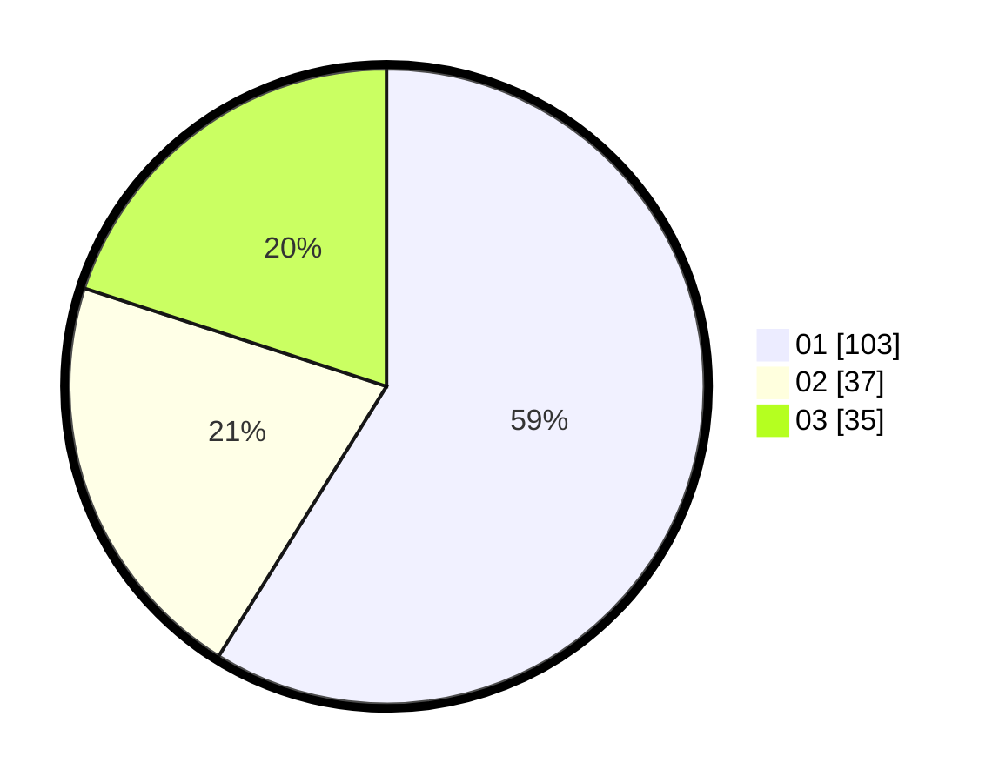

# Hasil

Hasil perolehan suara paslon dapat dilihat pada file paslon-01.txt, paslon-02.txt, dan paslon-03.txt.

Jika tidak ada, artinya data tersebut belum ada pada SIREKAP.

## Perolehan Suara

 * Paslon 01: **103**.
 * Paslon 02: **37**.
 * Paslon 03: **35**.

## Foto C Plano

https://sirekap-obj-formc.kpu.go.id/2808/pemilu/ppwp/31/75/04/10/01/3175041001030-20240216-221343--5050ae13-6480-4921-9adf-39668408e40b.jpg

https://sirekap-obj-formc.kpu.go.id/2808/pemilu/ppwp/31/75/04/10/01/3175041001030-20240218-121021--c52162f8-f0aa-4275-9174-c70993cf59f7.jpg

https://sirekap-obj-formc.kpu.go.id/2808/pemilu/ppwp/31/75/04/10/01/3175041001030-20240218-111126--a0e8e293-f2a0-491b-a215-5d299278d9c5.jpg

## DATA PEMILIH TETAP

Jumlah pemilih dalam DPT: **288**.
 * L: **145**.
 * P: **143**.

## DATA PENGGUNA HAK PILIH

Jumlah pengguna hak pilih dalam DPT: **220**.
 * L: **111**.
 * P: **109**.

Jumlah pengguna hak pilih dalam DPTb: **1**.
 * L: **0**.
 * P: **1**.

Jumlah pengguna hak pilih dalam DPK: **7**.
 * L: **5**.
 * P: **2**.

Jumlah pengguna hak pilih: **228**.
 * L: **116**.
 * P: **112**.

## JUMLAH SUARA SAH DAN TIDAK SAH

JUMLAH SELURUH SUARA SAH: **226**.

JUMLAH SUARA TIDAK SAH: **2**.

JUMLAH SELURUH SUARA SAH DAN SUARA TIDAK SAH: **228**.
