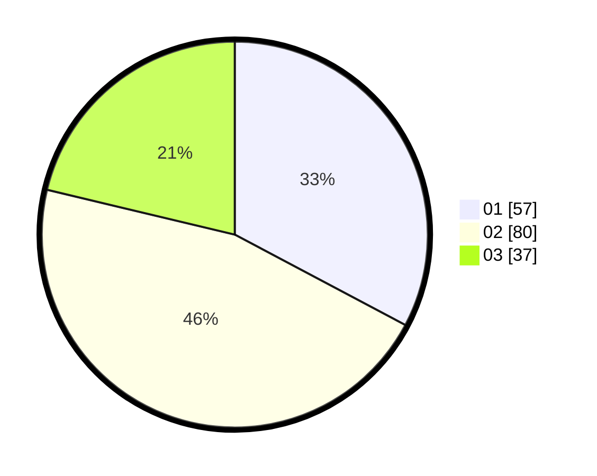

# Hasil

Hasil perolehan suara paslon dapat dilihat pada file paslon-01.txt, paslon-02.txt, dan paslon-03.txt.

Jika tidak ada, artinya data tersebut belum ada pada SIREKAP.

## Perolehan Suara

 * Paslon 01: **57**.
 * Paslon 02: **80**.
 * Paslon 03: **37**.

## Foto C Plano

https://sirekap-obj-formc.kpu.go.id/8589/pemilu/ppwp/31/75/04/10/01/3175041001033-20240214-213413--32a4bfc4-8f4d-4262-934d-630ec4bf13b2.jpg

https://sirekap-obj-formc.kpu.go.id/8589/pemilu/ppwp/31/75/04/10/01/3175041001033-20240214-213622--e0f779b4-df7d-4218-a870-00f3d4e8741d.jpg

https://sirekap-obj-formc.kpu.go.id/8589/pemilu/ppwp/31/75/04/10/01/3175041001033-20240214-214018--1532c200-0dbf-481e-9346-25f3bec78735.jpg
