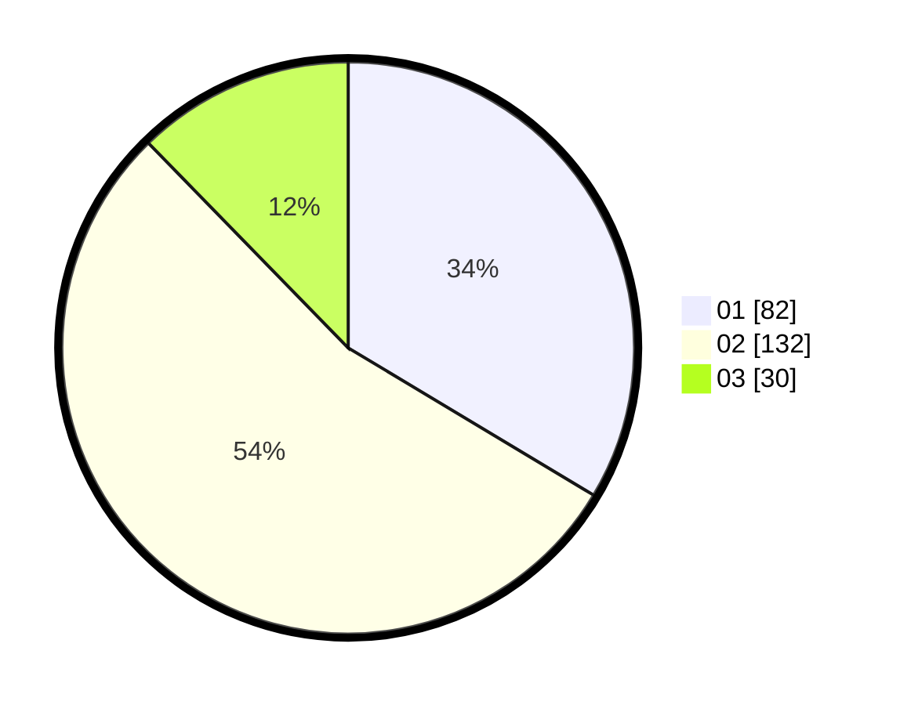

# Hasil

Hasil perolehan suara paslon dapat dilihat pada file paslon-01.txt, paslon-02.txt, dan paslon-03.txt.

Jika tidak ada, artinya data tersebut belum ada pada SIREKAP.

## Perolehan Suara

 * Paslon 01: **82**.
 * Paslon 02: **132**.
 * Paslon 03: **30**.

## Foto C Plano

https://sirekap-obj-formc.kpu.go.id/3a28/pemilu/ppwp/31/75/04/10/01/3175041001039-20240214-193836--ccf7a349-faf3-4fdd-a2a6-34f16943b86d.jpg

https://sirekap-obj-formc.kpu.go.id/3a28/pemilu/ppwp/31/75/04/10/01/3175041001039-20240214-193942--d7aeee1c-dfa7-4c93-afe0-8ace3e6a2364.jpg

https://sirekap-obj-formc.kpu.go.id/3a28/pemilu/ppwp/31/75/04/10/01/3175041001039-20240214-194037--5d7c8ef1-6caa-4a9b-95ac-2e7530e78e55.jpg

## DATA PEMILIH TETAP

Jumlah pemilih dalam DPT: **290**.
 * L: **140**.
 * P: **150**.

## DATA PENGGUNA HAK PILIH

Jumlah pengguna hak pilih dalam DPT: **246**.
 * L: **116**.
 * P: **130**.

Jumlah pengguna hak pilih dalam DPTb: **0**.
 * L: **0**.
 * P: **0**.

Jumlah pengguna hak pilih dalam DPK: **1**.
 * L: **1**.
 * P: **0**.

Jumlah pengguna hak pilih: **247**.
 * L: **117**.
 * P: **130**.

## JUMLAH SUARA SAH DAN TIDAK SAH

JUMLAH SELURUH SUARA SAH: **244**.

JUMLAH SUARA TIDAK SAH: **3**.

JUMLAH SELURUH SUARA SAH DAN SUARA TIDAK SAH: **247**.
