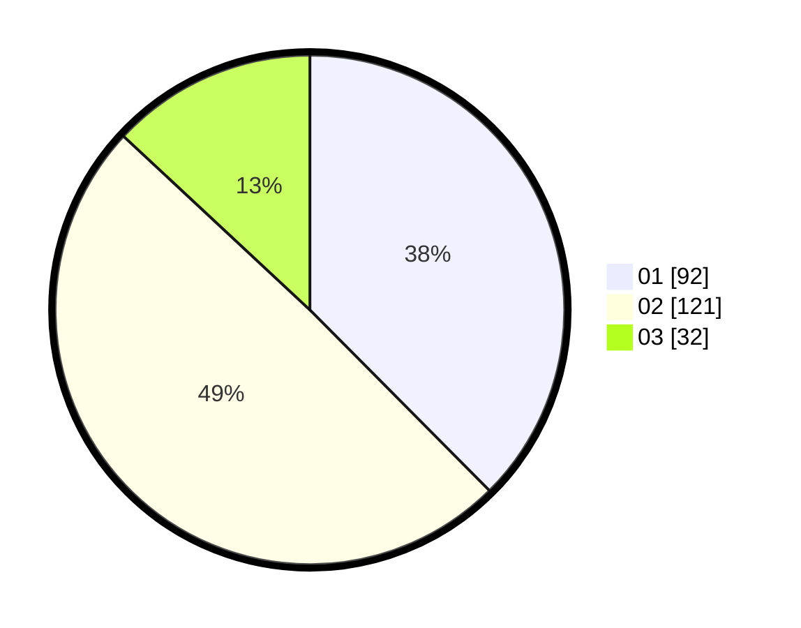

# Hasil

Hasil perolehan suara paslon dapat dilihat pada file paslon-01.txt, paslon-02.txt, dan paslon-03.txt.

Jika tidak ada, artinya data tersebut belum ada pada SIREKAP.

## Perolehan Suara

 * Paslon 01: **92**.
 * Paslon 02: **121**.
 * Paslon 03: **32**.

## Foto C Plano

https://sirekap-obj-formc.kpu.go.id/e33d/pemilu/ppwp/31/75/04/10/01/3175041001042-20240214-190605--fdf8bd91-1353-429a-813e-3364c5264ce6.jpg

https://sirekap-obj-formc.kpu.go.id/e33d/pemilu/ppwp/31/75/04/10/01/3175041001042-20240214-155301--cee1f19e-afac-40fa-85ca-dde6bbf76b2a.jpg

https://sirekap-obj-formc.kpu.go.id/e33d/pemilu/ppwp/31/75/04/10/01/3175041001042-20240214-155337--3759598c-6244-48e1-9acf-4db115e66c3f.jpg

## DATA PEMILIH TETAP

Jumlah pemilih dalam DPT: **297**.
 * L: **146**.
 * P: **151**.

## DATA PENGGUNA HAK PILIH

Jumlah pengguna hak pilih dalam DPT: **246**.
 * L: **118**.
 * P: **128**.

Jumlah pengguna hak pilih dalam DPTb: **0**.
 * L: **0**.
 * P: **0**.

Jumlah pengguna hak pilih dalam DPK: **3**.
 * L: **1**.
 * P: **2**.

Jumlah pengguna hak pilih: **249**.
 * L: **119**.
 * P: **130**.

## JUMLAH SUARA SAH DAN TIDAK SAH

JUMLAH SELURUH SUARA SAH: **245**.

JUMLAH SUARA TIDAK SAH: **4**.

JUMLAH SELURUH SUARA SAH DAN SUARA TIDAK SAH: **249**.
