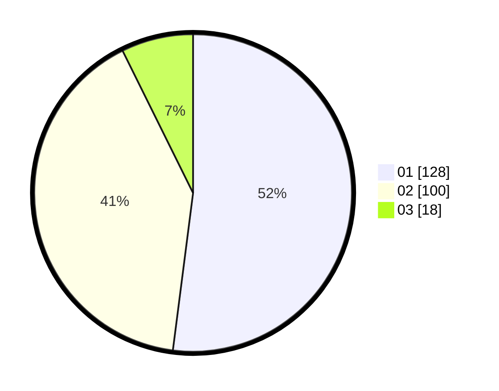

# Hasil

Hasil perolehan suara paslon dapat dilihat pada file paslon-01.txt, paslon-02.txt, dan paslon-03.txt.

Jika tidak ada, artinya data tersebut belum ada pada SIREKAP.

## Perolehan Suara

 * Paslon 01: **128**.
 * Paslon 02: **100**.
 * Paslon 03: **18**.

## Foto C Plano

https://sirekap-obj-formc.kpu.go.id/a0b4/pemilu/ppwp/31/75/04/10/01/3175041001045-20240214-195122--1eb1532e-9713-4ecc-80e1-d5464d521dd5.jpg

https://sirekap-obj-formc.kpu.go.id/a0b4/pemilu/ppwp/31/75/04/10/01/3175041001045-20240214-195330--648d935b-459c-4f7e-a7e2-1b42325a83a5.jpg

https://sirekap-obj-formc.kpu.go.id/a0b4/pemilu/ppwp/31/75/04/10/01/3175041001045-20240214-195440--9b406707-7cd7-461b-96a4-bea207323d92.jpg

## DATA PEMILIH TETAP

Jumlah pemilih dalam DPT: **296**.
 * L: **152**.
 * P: **144**.

## DATA PENGGUNA HAK PILIH

Jumlah pengguna hak pilih dalam DPT: **246**.
 * L: **122**.
 * P: **124**.

Jumlah pengguna hak pilih dalam DPTb: **0**.
 * L: **0**.
 * P: **0**.

Jumlah pengguna hak pilih dalam DPK: **3**.
 * L: **2**.
 * P: **1**.

Jumlah pengguna hak pilih: **249**.
 * L: **124**.
 * P: **125**.

## JUMLAH SUARA SAH DAN TIDAK SAH

JUMLAH SELURUH SUARA SAH: **246**.

JUMLAH SUARA TIDAK SAH: **3**.

JUMLAH SELURUH SUARA SAH DAN SUARA TIDAK SAH: **249**.
