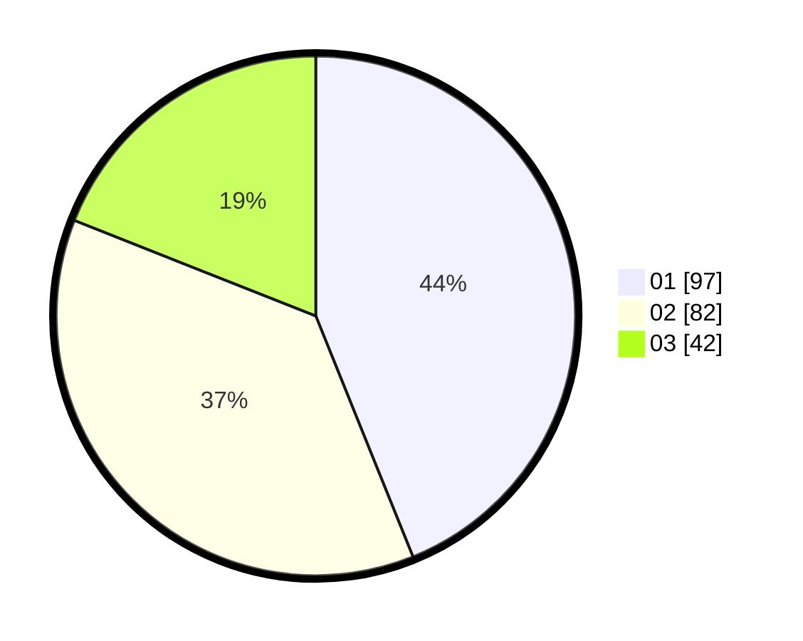

# Hasil

Hasil perolehan suara paslon dapat dilihat pada file paslon-01.txt, paslon-02.txt, dan paslon-03.txt.

Jika tidak ada, artinya data tersebut belum ada pada SIREKAP.

## Perolehan Suara

 * Paslon 01: **97**.
 * Paslon 02: **82**.
 * Paslon 03: **42**.

## Foto C Plano

https://sirekap-obj-formc.kpu.go.id/53d8/pemilu/ppwp/31/75/04/10/01/3175041001058-20240215-030623--433cc47e-81b1-4a06-a9c2-3688470cfe57.jpg

https://sirekap-obj-formc.kpu.go.id/53d8/pemilu/ppwp/31/75/04/10/01/3175041001058-20240214-223059--74bfefb0-c508-4db5-b441-ae89a0968097.jpg

https://sirekap-obj-formc.kpu.go.id/53d8/pemilu/ppwp/31/75/04/10/01/3175041001058-20240215-030815--c3e47826-4c46-4d73-9782-9e684a86f027.jpg
