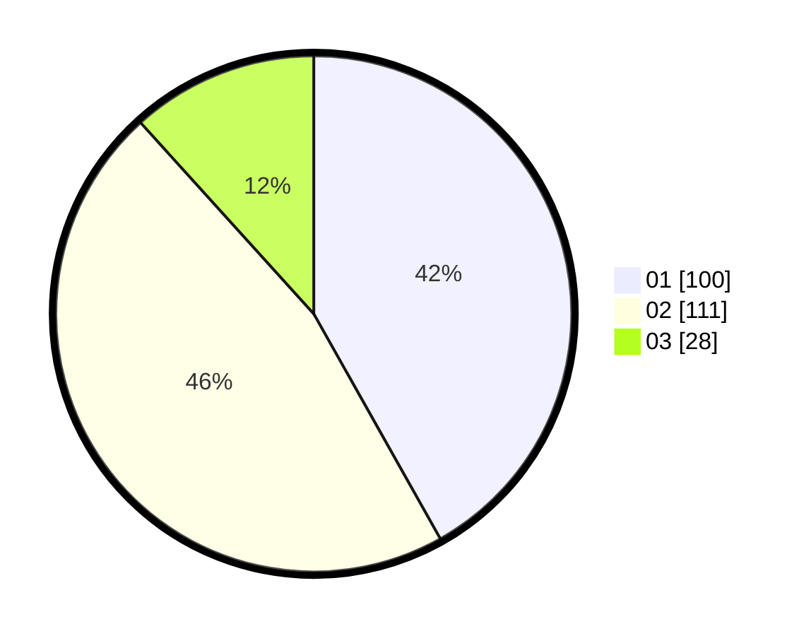

# Hasil

Hasil perolehan suara paslon dapat dilihat pada file paslon-01.txt, paslon-02.txt, dan paslon-03.txt.

Jika tidak ada, artinya data tersebut belum ada pada SIREKAP.

## Perolehan Suara

 * Paslon 01: **100**.
 * Paslon 02: **111**.
 * Paslon 03: **28**.

## Foto C Plano

https://sirekap-obj-formc.kpu.go.id/5089/pemilu/ppwp/31/75/04/10/01/3175041001061-20240214-224914--24facc75-d549-4e7a-abb1-ad277f34dcb3.jpg

https://sirekap-obj-formc.kpu.go.id/5089/pemilu/ppwp/31/75/04/10/01/3175041001061-20240214-225009--cad001a5-631f-4410-be8c-3355ff36e393.jpg

https://sirekap-obj-formc.kpu.go.id/5089/pemilu/ppwp/31/75/04/10/01/3175041001061-20240214-225114--4be85a62-3295-4fbc-bce4-528120405225.jpg
