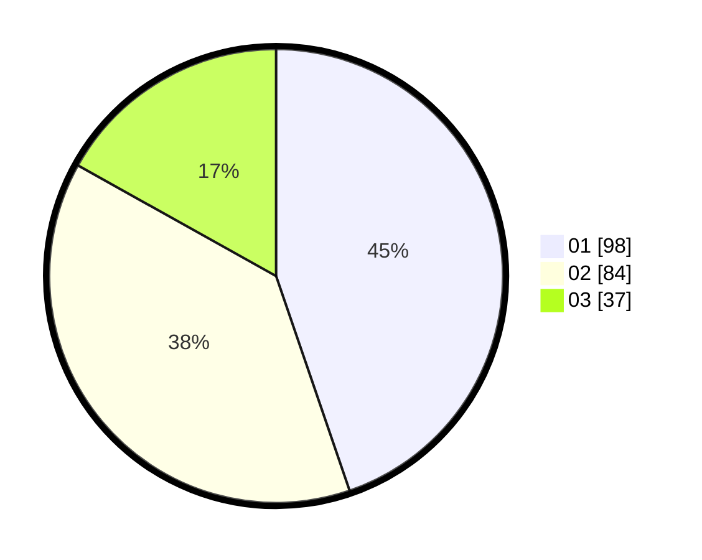

# Hasil

Hasil perolehan suara paslon dapat dilihat pada file paslon-01.txt, paslon-02.txt, dan paslon-03.txt.

Jika tidak ada, artinya data tersebut belum ada pada SIREKAP.

## Perolehan Suara

 * Paslon 01: **98**.
 * Paslon 02: **84**.
 * Paslon 03: **37**.

## Foto C Plano

https://sirekap-obj-formc.kpu.go.id/ff96/pemilu/ppwp/31/75/04/10/01/3175041001065-20240219-085029--44efa80e-9a88-4a03-b069-1fc1b0d4b38a.jpg

https://sirekap-obj-formc.kpu.go.id/ff96/pemilu/ppwp/31/75/04/10/01/3175041001065-20240219-084938--de11ed39-cb0c-4d3a-8cb0-dfbcbb767fa7.jpg

https://sirekap-obj-formc.kpu.go.id/ff96/pemilu/ppwp/31/75/04/10/01/3175041001065-20240219-084825--9eaeb83d-4895-4ea0-ab2c-07a1156f917d.jpg
