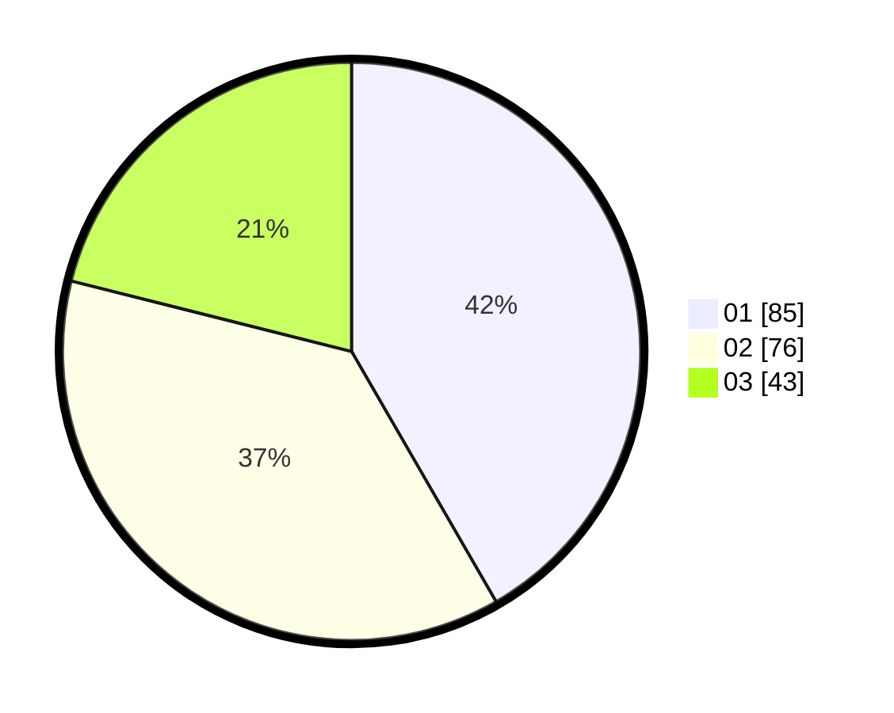

# Hasil

Hasil perolehan suara paslon dapat dilihat pada file paslon-01.txt, paslon-02.txt, dan paslon-03.txt.

Jika tidak ada, artinya data tersebut belum ada pada SIREKAP.

## Perolehan Suara

 * Paslon 01: **85**.
 * Paslon 02: **76**.
 * Paslon 03: **43**.

## Foto C Plano

https://sirekap-obj-formc.kpu.go.id/420a/pemilu/ppwp/31/75/04/10/01/3175041001070-20240214-215628--6a00ad77-664f-450d-9470-86f7a057b7c1.jpg

https://sirekap-obj-formc.kpu.go.id/420a/pemilu/ppwp/31/75/04/10/01/3175041001070-20240214-215828--2b09bad8-c66b-4be1-a969-4362fcc4e99d.jpg

https://sirekap-obj-formc.kpu.go.id/420a/pemilu/ppwp/31/75/04/10/01/3175041001070-20240214-215745--27380bff-b86a-4442-8911-540944c90e20.jpg

## DATA PEMILIH TETAP

Jumlah pemilih dalam DPT: **274**.
 * L: **147**.
 * P: **127**.

## DATA PENGGUNA HAK PILIH

Jumlah pengguna hak pilih dalam DPT: **204**.
 * L: **104**.
 * P: **100**.

Jumlah pengguna hak pilih dalam DPTb: **0**.
 * L: **0**.
 * P: **0**.

Jumlah pengguna hak pilih dalam DPK: **3**.
 * L: **2**.
 * P: **1**.

Jumlah pengguna hak pilih: **207**.
 * L: **106**.
 * P: **101**.

## JUMLAH SUARA SAH DAN TIDAK SAH

JUMLAH SELURUH SUARA SAH: **204**.

JUMLAH SUARA TIDAK SAH: **3**.

JUMLAH SELURUH SUARA SAH DAN SUARA TIDAK SAH: **207**.
