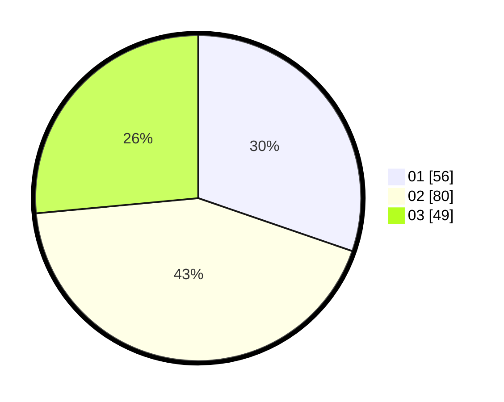

# Hasil

Hasil perolehan suara paslon dapat dilihat pada file paslon-01.txt, paslon-02.txt, dan paslon-03.txt.

Jika tidak ada, artinya data tersebut belum ada pada SIREKAP.

## Perolehan Suara

 * Paslon 01: **56**.
 * Paslon 02: **80**.
 * Paslon 03: **49**.

## Foto C Plano

https://sirekap-obj-formc.kpu.go.id/b724/pemilu/ppwp/31/75/04/10/01/3175041001077-20240214-185156--8b398703-2e15-43b5-8025-e1ad88677b6f.jpg

https://sirekap-obj-formc.kpu.go.id/b724/pemilu/ppwp/31/75/04/10/01/3175041001077-20240214-185000--44a9dbd0-335d-40e1-8017-0daa7c43d31b.jpg

https://sirekap-obj-formc.kpu.go.id/b724/pemilu/ppwp/31/75/04/10/01/3175041001077-20240214-185155--e6239e9e-a3b1-4582-a551-e9433d9cb42b.jpg

## DATA PEMILIH TETAP

Jumlah pemilih dalam DPT: **259**.
 * L: **126**.
 * P: **133**.

## DATA PENGGUNA HAK PILIH

Jumlah pengguna hak pilih dalam DPT: **188**.
 * L: **86**.
 * P: **102**.

Jumlah pengguna hak pilih dalam DPTb: **0**.
 * L: **0**.
 * P: **0**.

Jumlah pengguna hak pilih dalam DPK: **1**.
 * L: **1**.
 * P: **0**.

Jumlah pengguna hak pilih: **189**.
 * L: **87**.
 * P: **102**.

## JUMLAH SUARA SAH DAN TIDAK SAH

JUMLAH SELURUH SUARA SAH: **185**.

JUMLAH SUARA TIDAK SAH: **4**.

JUMLAH SELURUH SUARA SAH DAN SUARA TIDAK SAH: **189**.
