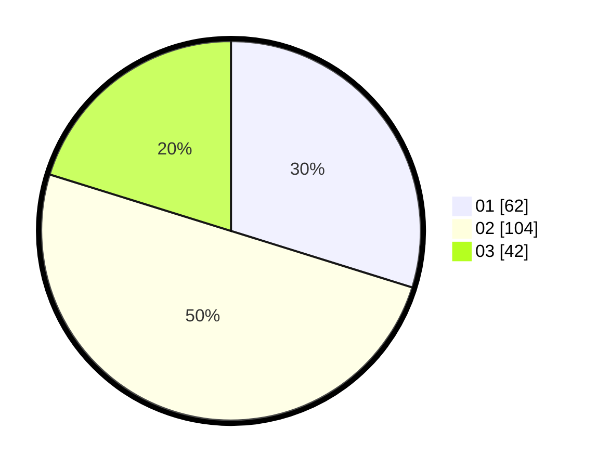

# Hasil

Hasil perolehan suara paslon dapat dilihat pada file paslon-01.txt, paslon-02.txt, dan paslon-03.txt.

Jika tidak ada, artinya data tersebut belum ada pada SIREKAP.

## Perolehan Suara

 * Paslon 01: **62**.
 * Paslon 02: **104**.
 * Paslon 03: **42**.

## Foto C Plano

https://sirekap-obj-formc.kpu.go.id/594e/pemilu/ppwp/31/75/04/10/01/3175041001079-20240217-161552--b8ee617d-983e-4de0-ad59-6d22dadf682d.jpg

https://sirekap-obj-formc.kpu.go.id/594e/pemilu/ppwp/31/75/04/10/01/3175041001079-20240217-163011--e13bc86c-3d8b-4b3b-a221-8d73ff792ee9.jpg

https://sirekap-obj-formc.kpu.go.id/594e/pemilu/ppwp/31/75/04/10/01/3175041001079-20240217-163603--585a0a2e-7f43-4edd-99ef-1578039f58b1.jpg

## DATA PEMILIH TETAP

Jumlah pemilih dalam DPT: **251**.
 * L: **135**.
 * P: **116**.

## DATA PENGGUNA HAK PILIH

Jumlah pengguna hak pilih dalam DPT: **206**.
 * L: **110**.
 * P: **96**.

Jumlah pengguna hak pilih dalam DPTb: **0**.
 * L: **0**.
 * P: **0**.

Jumlah pengguna hak pilih dalam DPK: **4**.
 * L: **3**.
 * P: **1**.

Jumlah pengguna hak pilih: **210**.
 * L: **113**.
 * P: **97**.

## JUMLAH SUARA SAH DAN TIDAK SAH

JUMLAH SELURUH SUARA SAH: **208**.

JUMLAH SUARA TIDAK SAH: **2**.

JUMLAH SELURUH SUARA SAH DAN SUARA TIDAK SAH: **210**.
