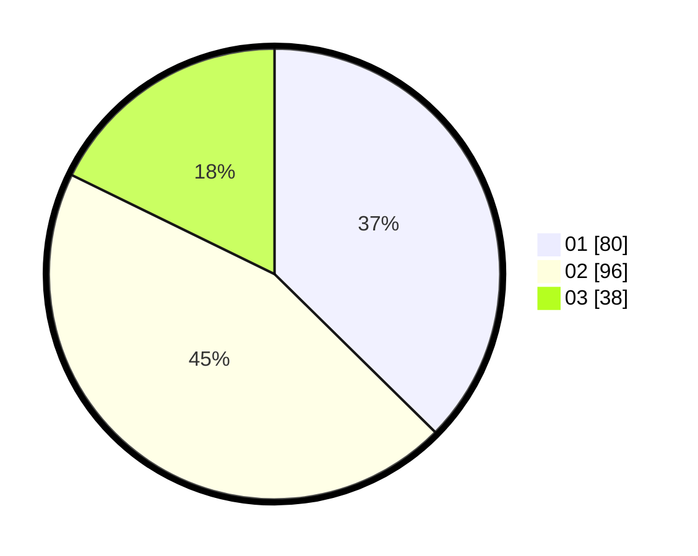

# Hasil

Hasil perolehan suara paslon dapat dilihat pada file paslon-01.txt, paslon-02.txt, dan paslon-03.txt.

Jika tidak ada, artinya data tersebut belum ada pada SIREKAP.

## Perolehan Suara

 * Paslon 01: **80**.
 * Paslon 02: **96**.
 * Paslon 03: **38**.

## Foto C Plano

https://sirekap-obj-formc.kpu.go.id/aa50/pemilu/ppwp/31/75/04/10/01/3175041001081-20240214-225901--aa94f7a7-eca7-474f-aab6-8591ae05ad2b.jpg

https://sirekap-obj-formc.kpu.go.id/aa50/pemilu/ppwp/31/75/04/10/01/3175041001081-20240214-225931--afa49ed6-fedf-4ad8-9d95-540345310ecf.jpg

https://sirekap-obj-formc.kpu.go.id/aa50/pemilu/ppwp/31/75/04/10/01/3175041001081-20240214-230020--39db64a2-3249-4d37-955d-4f69df42f195.jpg
