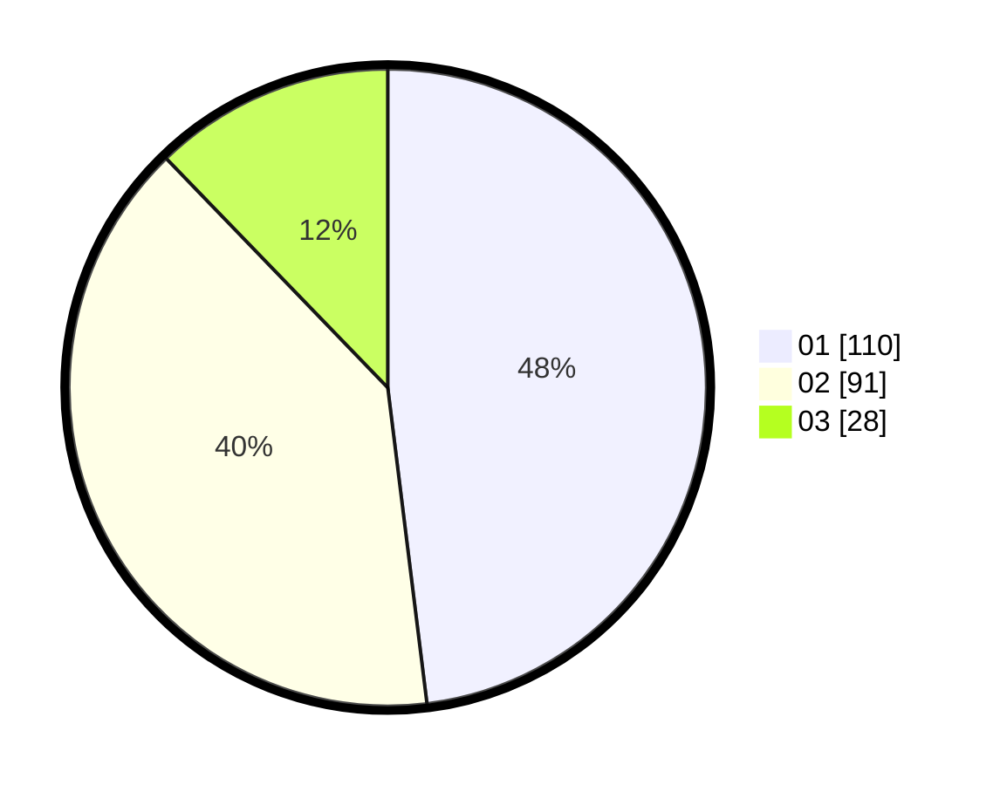

# Hasil

Hasil perolehan suara paslon dapat dilihat pada file paslon-01.txt, paslon-02.txt, dan paslon-03.txt.

Jika tidak ada, artinya data tersebut belum ada pada SIREKAP.

## Perolehan Suara

 * Paslon 01: **110**.
 * Paslon 02: **91**.
 * Paslon 03: **28**.

## Foto C Plano

https://sirekap-obj-formc.kpu.go.id/ae37/pemilu/ppwp/31/75/04/10/01/3175041001090-20240214-210608--9ada0724-5d13-45d0-bf1d-bfe8c00b7d88.jpg

https://sirekap-obj-formc.kpu.go.id/ae37/pemilu/ppwp/31/75/04/10/01/3175041001090-20240216-080317--e2274250-a3c8-4e30-891e-e8b5c4772b9d.jpg

https://sirekap-obj-formc.kpu.go.id/ae37/pemilu/ppwp/31/75/04/10/01/3175041001090-20240214-210857--3e416c6a-c63f-40b2-8fce-9fb55497ce28.jpg
