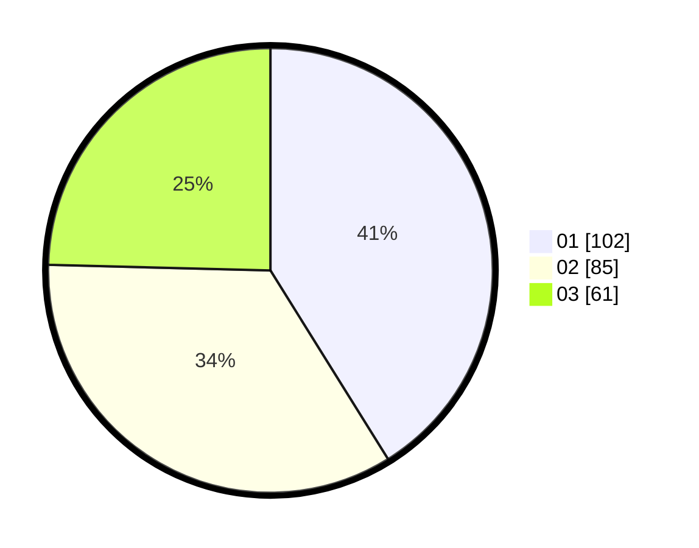

# Hasil

Hasil perolehan suara paslon dapat dilihat pada file paslon-01.txt, paslon-02.txt, dan paslon-03.txt.

Jika tidak ada, artinya data tersebut belum ada pada SIREKAP.

## Perolehan Suara

 * Paslon 01: **102**.
 * Paslon 02: **85**.
 * Paslon 03: **61**.

## Foto C Plano

https://sirekap-obj-formc.kpu.go.id/2c9d/pemilu/ppwp/31/75/04/10/01/3175041001091-20240217-165906--3142dc0d-a53b-4718-a0e3-41dbcd096a8a.jpg

https://sirekap-obj-formc.kpu.go.id/2c9d/pemilu/ppwp/31/75/04/10/01/3175041001091-20240217-170724--b53268a0-60a6-460e-8abf-97160e517c7b.jpg

https://sirekap-obj-formc.kpu.go.id/2c9d/pemilu/ppwp/31/75/04/10/01/3175041001091-20240217-170449--b1c51a05-900a-401d-a3e7-e355da8fda0b.jpg

## DATA PEMILIH TETAP

Jumlah pemilih dalam DPT: **290**.
 * L: **128**.
 * P: **162**.

## DATA PENGGUNA HAK PILIH

Jumlah pengguna hak pilih dalam DPT: **241**.
 * L: **109**.
 * P: **132**.

Jumlah pengguna hak pilih dalam DPTb: **1**.
 * L: **1**.
 * P: **0**.

Jumlah pengguna hak pilih dalam DPK: **8**.
 * L: **0**.
 * P: **8**.

Jumlah pengguna hak pilih: **250**.
 * L: **110**.
 * P: **140**.

## JUMLAH SUARA SAH DAN TIDAK SAH

JUMLAH SELURUH SUARA SAH: **248**.

JUMLAH SUARA TIDAK SAH: **2**.

JUMLAH SELURUH SUARA SAH DAN SUARA TIDAK SAH: **250**.
