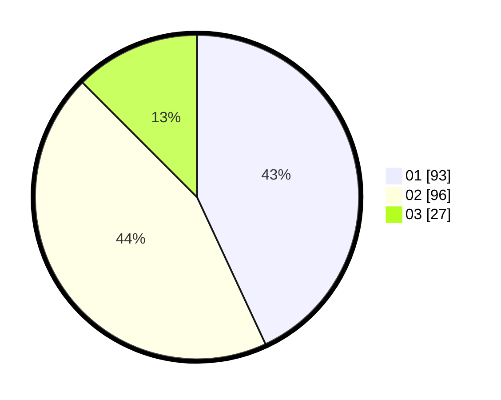

# Hasil

Hasil perolehan suara paslon dapat dilihat pada file paslon-01.txt, paslon-02.txt, dan paslon-03.txt.

Jika tidak ada, artinya data tersebut belum ada pada SIREKAP.

## Perolehan Suara

 * Paslon 01: **93**.
 * Paslon 02: **96**.
 * Paslon 03: **27**.

## Foto C Plano

https://sirekap-obj-formc.kpu.go.id/d353/pemilu/ppwp/31/75/04/10/01/3175041001092-20240214-184548--b9d6edfe-31bd-41ca-80d5-cba6814d9375.jpg

https://sirekap-obj-formc.kpu.go.id/d353/pemilu/ppwp/31/75/04/10/01/3175041001092-20240217-160608--633714f4-ae91-47e9-9f9a-5f32dd9f1254.jpg
