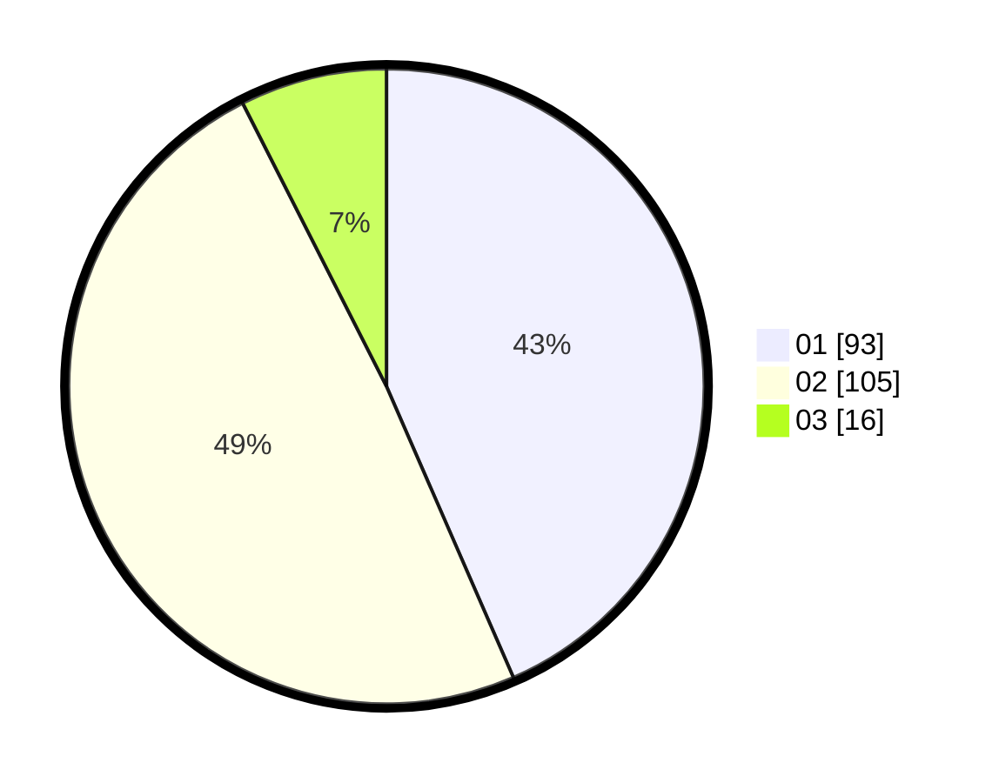

# Hasil

Hasil perolehan suara paslon dapat dilihat pada file paslon-01.txt, paslon-02.txt, dan paslon-03.txt.

Jika tidak ada, artinya data tersebut belum ada pada SIREKAP.

## Perolehan Suara

 * Paslon 01: **93**.
 * Paslon 02: **105**.
 * Paslon 03: **16**.

## Foto C Plano

https://sirekap-obj-formc.kpu.go.id/aa04/pemilu/ppwp/31/75/04/10/01/3175041001096-20240219-130935--6c02f0e3-3b6b-4651-920c-bed24213c5c3.jpg

https://sirekap-obj-formc.kpu.go.id/aa04/pemilu/ppwp/31/75/04/10/01/3175041001096-20240219-130319--072ca513-6e93-441e-933f-c61babcf50a2.jpg

https://sirekap-obj-formc.kpu.go.id/aa04/pemilu/ppwp/31/75/04/10/01/3175041001096-20240218-164339--5f73890a-00ff-4642-b33a-cc94e952b128.jpg

## DATA PEMILIH TETAP

Jumlah pemilih dalam DPT: **271**.
 * L: **134**.
 * P: **137**.

## DATA PENGGUNA HAK PILIH

Jumlah pengguna hak pilih dalam DPT: **214**.
 * L: **103**.
 * P: **111**.

Jumlah pengguna hak pilih dalam DPTb: **0**.
 * L: **0**.
 * P: **0**.

Jumlah pengguna hak pilih dalam DPK: **2**.
 * L: **1**.
 * P: **1**.

Jumlah pengguna hak pilih: **216**.
 * L: **104**.
 * P: **112**.

## JUMLAH SUARA SAH DAN TIDAK SAH

JUMLAH SELURUH SUARA SAH: **214**.

JUMLAH SUARA TIDAK SAH: **2**.

JUMLAH SELURUH SUARA SAH DAN SUARA TIDAK SAH: **216**.
