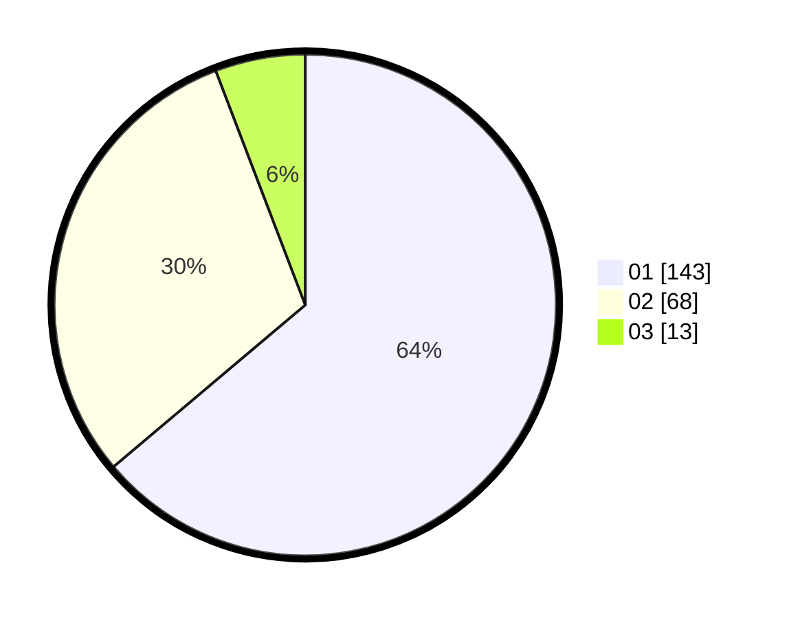

# Hasil

Hasil perolehan suara paslon dapat dilihat pada file paslon-01.txt, paslon-02.txt, dan paslon-03.txt.

Jika tidak ada, artinya data tersebut belum ada pada SIREKAP.

## Perolehan Suara

 * Paslon 01: **143**.
 * Paslon 02: **68**.
 * Paslon 03: **13**.

## Foto C Plano

https://sirekap-obj-formc.kpu.go.id/d054/pemilu/ppwp/31/75/04/10/01/3175041001099-20240215-033800--4e31a1f4-cb05-40e8-88c3-ce0ff5093b1a.jpg

https://sirekap-obj-formc.kpu.go.id/d054/pemilu/ppwp/31/75/04/10/01/3175041001099-20240215-034207--f2329fef-5a17-47be-92b3-19ed7e2f36b4.jpg

https://sirekap-obj-formc.kpu.go.id/d054/pemilu/ppwp/31/75/04/10/01/3175041001099-20240215-034257--f0cfb552-1c8a-45bf-84a7-9be96c3b14ae.jpg
