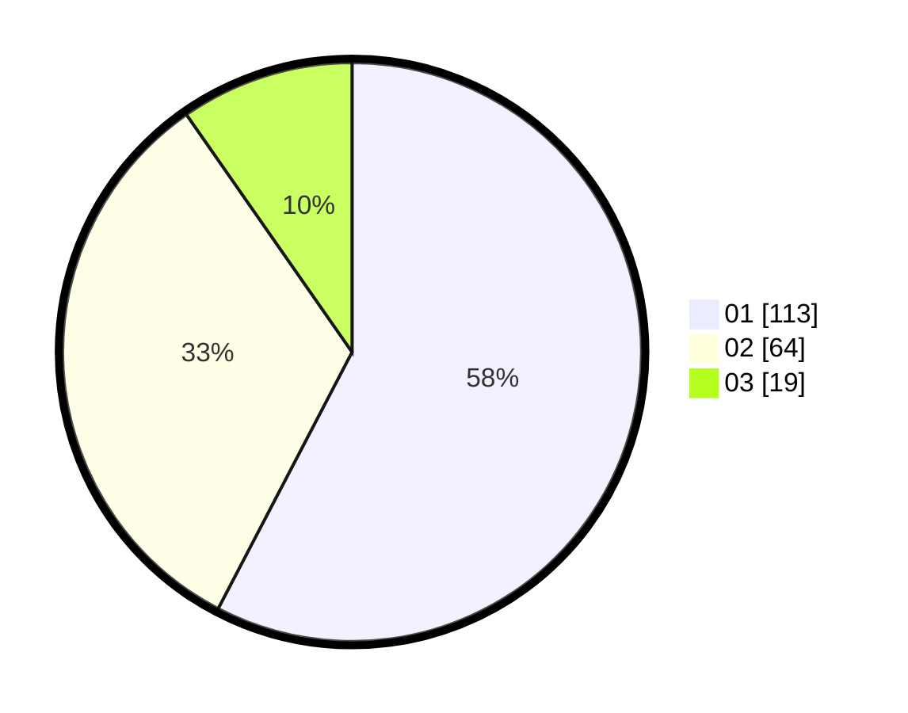

# Hasil

Hasil perolehan suara paslon dapat dilihat pada file paslon-01.txt, paslon-02.txt, dan paslon-03.txt.

Jika tidak ada, artinya data tersebut belum ada pada SIREKAP.

## Perolehan Suara

 * Paslon 01: **113**.
 * Paslon 02: **64**.
 * Paslon 03: **19**.

## Foto C Plano

https://sirekap-obj-formc.kpu.go.id/de8c/pemilu/ppwp/31/75/04/10/01/3175041001101-20240214-234507--41d2078c-229f-44a3-bb4b-c582056b5e4c.jpg

https://sirekap-obj-formc.kpu.go.id/de8c/pemilu/ppwp/31/75/04/10/01/3175041001101-20240214-234610--10d35e47-11d3-45ba-ab1d-b5049c4fa87d.jpg

https://sirekap-obj-formc.kpu.go.id/de8c/pemilu/ppwp/31/75/04/10/01/3175041001101-20240214-234712--d24f4d8a-befa-473c-8a75-617d9a78226f.jpg
