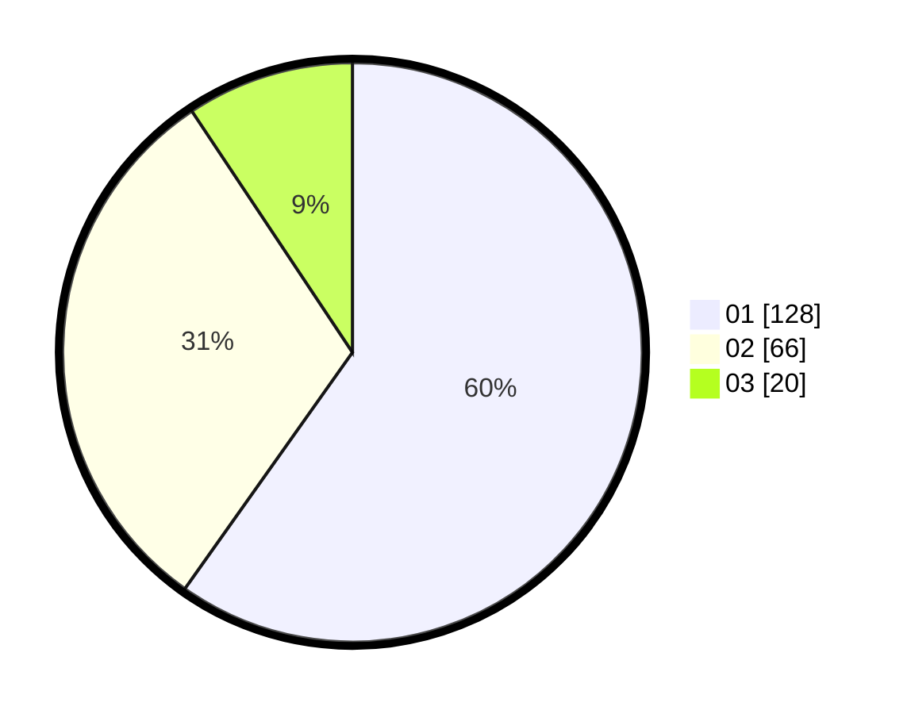

# Hasil

Hasil perolehan suara paslon dapat dilihat pada file paslon-01.txt, paslon-02.txt, dan paslon-03.txt.

Jika tidak ada, artinya data tersebut belum ada pada SIREKAP.

## Perolehan Suara

 * Paslon 01: **128**.
 * Paslon 02: **66**.
 * Paslon 03: **20**.

## Foto C Plano

https://sirekap-obj-formc.kpu.go.id/84c2/pemilu/ppwp/31/75/04/10/01/3175041001102-20240216-074621--227d0fb3-4fde-4ef3-90ae-f7e3cc270526.jpg

https://sirekap-obj-formc.kpu.go.id/84c2/pemilu/ppwp/31/75/04/10/01/3175041001102-20240216-094801--ad9955ff-88f7-43fc-b55a-842e2f68f95f.jpg

https://sirekap-obj-formc.kpu.go.id/84c2/pemilu/ppwp/31/75/04/10/01/3175041001102-20240216-100025--77f78e4a-91ea-43fe-9c60-c94e7989aea9.jpg

## DATA PEMILIH TETAP

Jumlah pemilih dalam DPT: **264**.
 * L: **125**.
 * P: **139**.

## DATA PENGGUNA HAK PILIH

Jumlah pengguna hak pilih dalam DPT: **216**.
 * L: **104**.
 * P: **112**.

Jumlah pengguna hak pilih dalam DPTb: **0**.
 * L: **0**.
 * P: **0**.

Jumlah pengguna hak pilih dalam DPK: **0**.
 * L: **0**.
 * P: **0**.

Jumlah pengguna hak pilih: **216**.
 * L: **104**.
 * P: **112**.

## JUMLAH SUARA SAH DAN TIDAK SAH

JUMLAH SELURUH SUARA SAH: **214**.

JUMLAH SUARA TIDAK SAH: **2**.

JUMLAH SELURUH SUARA SAH DAN SUARA TIDAK SAH: **216**.
