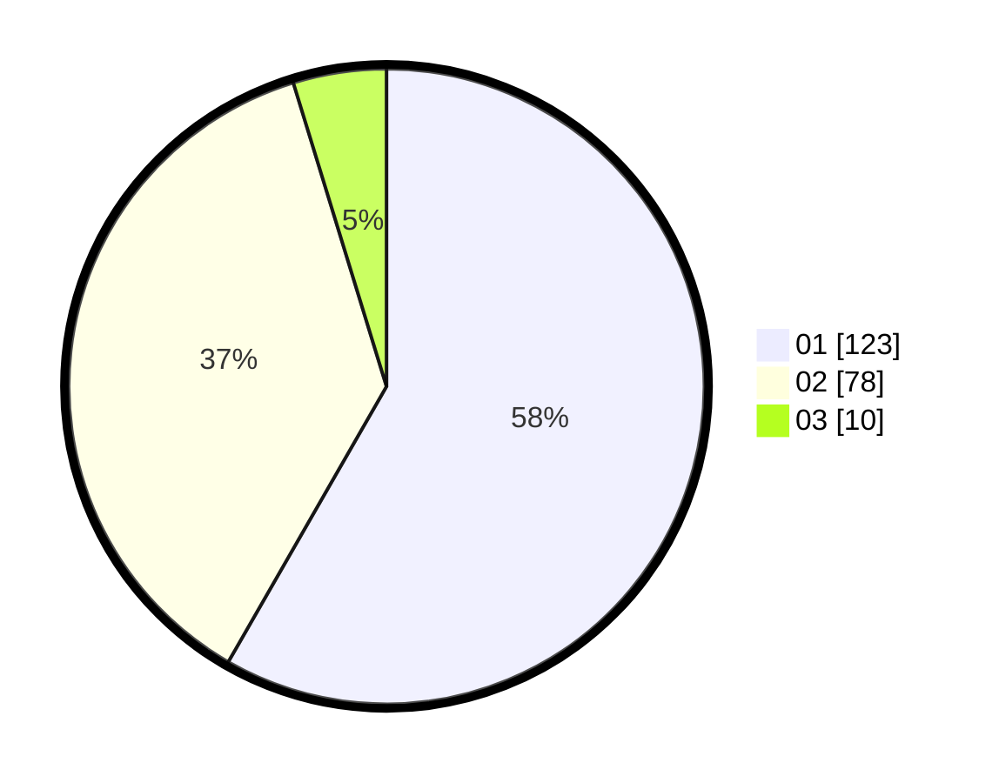

# Hasil

Hasil perolehan suara paslon dapat dilihat pada file paslon-01.txt, paslon-02.txt, dan paslon-03.txt.

Jika tidak ada, artinya data tersebut belum ada pada SIREKAP.

## Perolehan Suara

 * Paslon 01: **123**.
 * Paslon 02: **78**.
 * Paslon 03: **10**.

## Foto C Plano

https://sirekap-obj-formc.kpu.go.id/e5e3/pemilu/ppwp/31/75/04/10/01/3175041001104-20240214-233235--d23985a9-5cc4-4383-8831-a71cc47e8396.jpg

https://sirekap-obj-formc.kpu.go.id/e5e3/pemilu/ppwp/31/75/04/10/01/3175041001104-20240215-001851--d8d76a55-a51d-434a-8daa-375b41b31570.jpg

https://sirekap-obj-formc.kpu.go.id/e5e3/pemilu/ppwp/31/75/04/10/01/3175041001104-20240214-200140--83698ec4-c83c-4f92-9046-4546d894b7af.jpg

## DATA PEMILIH TETAP

Jumlah pemilih dalam DPT: **264**.
 * L: **129**.
 * P: **135**.

## DATA PENGGUNA HAK PILIH

Jumlah pengguna hak pilih dalam DPT: **213**.
 * L: **101**.
 * P: **112**.

Jumlah pengguna hak pilih dalam DPTb: **0**.
 * L: **0**.
 * P: **0**.

Jumlah pengguna hak pilih dalam DPK: **1**.
 * L: **1**.
 * P: **0**.

Jumlah pengguna hak pilih: **214**.
 * L: **102**.
 * P: **112**.

## JUMLAH SUARA SAH DAN TIDAK SAH

JUMLAH SELURUH SUARA SAH: **211**.

JUMLAH SUARA TIDAK SAH: **3**.

JUMLAH SELURUH SUARA SAH DAN SUARA TIDAK SAH: **214**.
