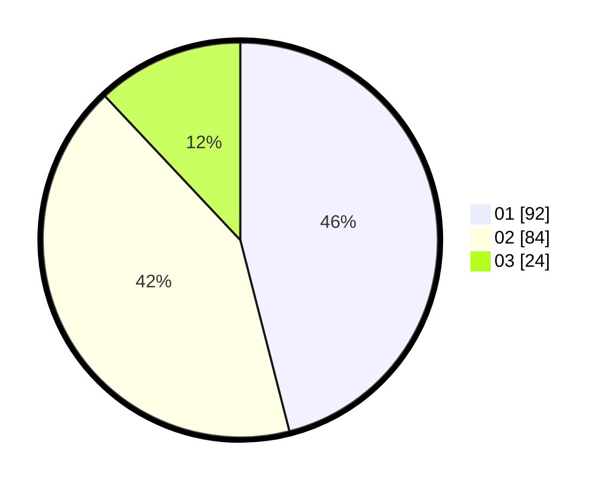

# Hasil

Hasil perolehan suara paslon dapat dilihat pada file paslon-01.txt, paslon-02.txt, dan paslon-03.txt.

Jika tidak ada, artinya data tersebut belum ada pada SIREKAP.

## Perolehan Suara

 * Paslon 01: **92**.
 * Paslon 02: **84**.
 * Paslon 03: **24**.

## Foto C Plano

https://sirekap-obj-formc.kpu.go.id/4220/pemilu/ppwp/31/75/04/10/01/3175041001105-20240214-184533--e8caa113-8242-455c-931d-466f39352e7c.jpg

https://sirekap-obj-formc.kpu.go.id/4220/pemilu/ppwp/31/75/04/10/01/3175041001105-20240214-190413--109866e6-2831-4066-88d9-9fbaabd237db.jpg

https://sirekap-obj-formc.kpu.go.id/4220/pemilu/ppwp/31/75/04/10/01/3175041001105-20240214-190700--e5a7a7f7-925e-45e0-920d-f2d18fb44415.jpg

## DATA PEMILIH TETAP

Jumlah pemilih dalam DPT: **279**.
 * L: **134**.
 * P: **145**.

## DATA PENGGUNA HAK PILIH

Jumlah pengguna hak pilih dalam DPT: **203**.
 * L: **95**.
 * P: **108**.

Jumlah pengguna hak pilih dalam DPTb: **0**.
 * L: **0**.
 * P: **0**.

Jumlah pengguna hak pilih dalam DPK: **0**.
 * L: **0**.
 * P: **0**.

Jumlah pengguna hak pilih: **203**.
 * L: **95**.
 * P: **108**.

## JUMLAH SUARA SAH DAN TIDAK SAH

JUMLAH SELURUH SUARA SAH: **200**.

JUMLAH SUARA TIDAK SAH: **3**.

JUMLAH SELURUH SUARA SAH DAN SUARA TIDAK SAH: **203**.
