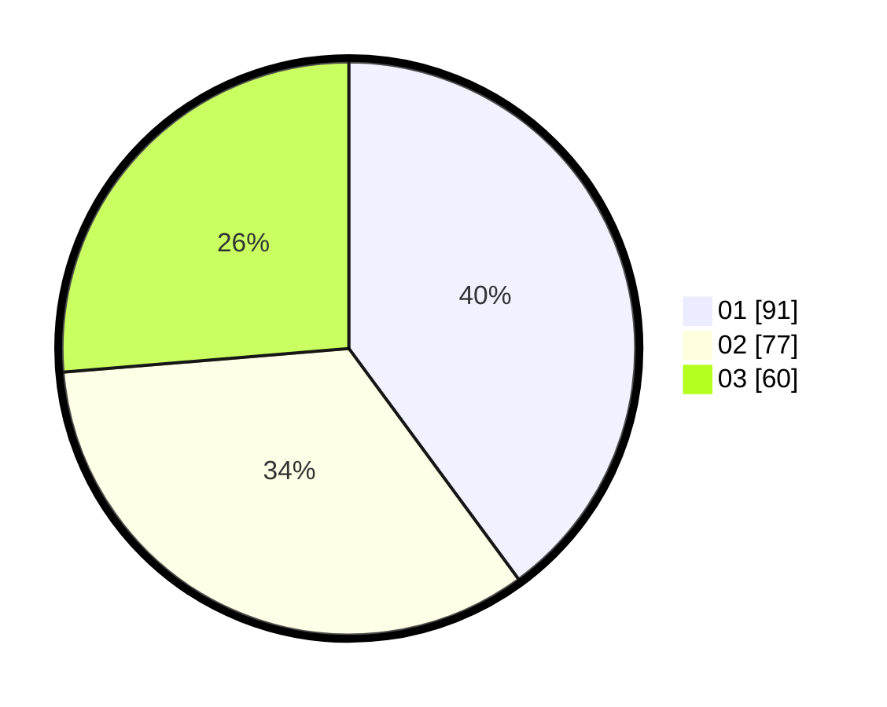

# Hasil

Hasil perolehan suara paslon dapat dilihat pada file paslon-01.txt, paslon-02.txt, dan paslon-03.txt.

Jika tidak ada, artinya data tersebut belum ada pada SIREKAP.

## Perolehan Suara

 * Paslon 01: **91**.
 * Paslon 02: **77**.
 * Paslon 03: **60**.

## Foto C Plano

https://sirekap-obj-formc.kpu.go.id/6766/pemilu/ppwp/31/75/04/10/01/3175041001106-20240215-013445--94edaf5a-9382-48a4-8b8b-10e5f4e089c0.jpg

https://sirekap-obj-formc.kpu.go.id/6766/pemilu/ppwp/31/75/04/10/01/3175041001106-20240215-013556--7fb9ed49-dae6-4952-a992-edb6c4cb6e77.jpg

https://sirekap-obj-formc.kpu.go.id/6766/pemilu/ppwp/31/75/04/10/01/3175041001106-20240215-014016--51129430-db1b-4105-8801-75bcc1788e51.jpg
