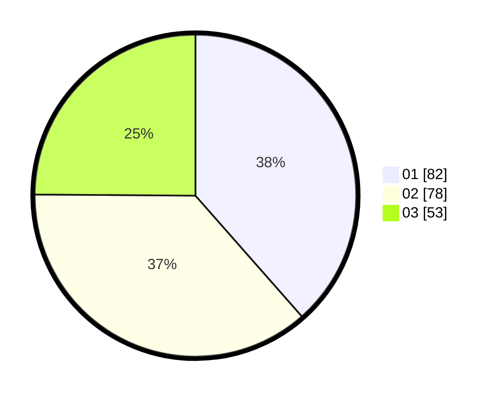

# Hasil

Hasil perolehan suara paslon dapat dilihat pada file paslon-01.txt, paslon-02.txt, dan paslon-03.txt.

Jika tidak ada, artinya data tersebut belum ada pada SIREKAP.

## Perolehan Suara

 * Paslon 01: **82**.
 * Paslon 02: **78**.
 * Paslon 03: **53**.

## Foto C Plano

https://sirekap-obj-formc.kpu.go.id/fc32/pemilu/ppwp/31/75/04/10/01/3175041001113-20240217-163811--e4b95530-210d-4e77-a94d-cc329511c9fa.jpg

https://sirekap-obj-formc.kpu.go.id/fc32/pemilu/ppwp/31/75/04/10/01/3175041001113-20240217-170701--7a127fda-f88e-423e-9d3c-977efdc047e3.jpg

https://sirekap-obj-formc.kpu.go.id/fc32/pemilu/ppwp/31/75/04/10/01/3175041001113-20240217-164121--7b2d0430-5db2-46d6-bcca-c271731a0b5d.jpg

## DATA PEMILIH TETAP

Jumlah pemilih dalam DPT: **250**.
 * L: **112**.
 * P: **138**.

## DATA PENGGUNA HAK PILIH

Jumlah pengguna hak pilih dalam DPT: **215**.
 * L: **93**.
 * P: **122**.

Jumlah pengguna hak pilih dalam DPTb: **0**.
 * L: **0**.
 * P: **0**.

Jumlah pengguna hak pilih dalam DPK: **0**.
 * L: **0**.
 * P: **0**.

Jumlah pengguna hak pilih: **215**.
 * L: **93**.
 * P: **122**.

## JUMLAH SUARA SAH DAN TIDAK SAH

JUMLAH SELURUH SUARA SAH: **215**.

JUMLAH SUARA TIDAK SAH: **2**.

JUMLAH SELURUH SUARA SAH DAN SUARA TIDAK SAH: **215**.
