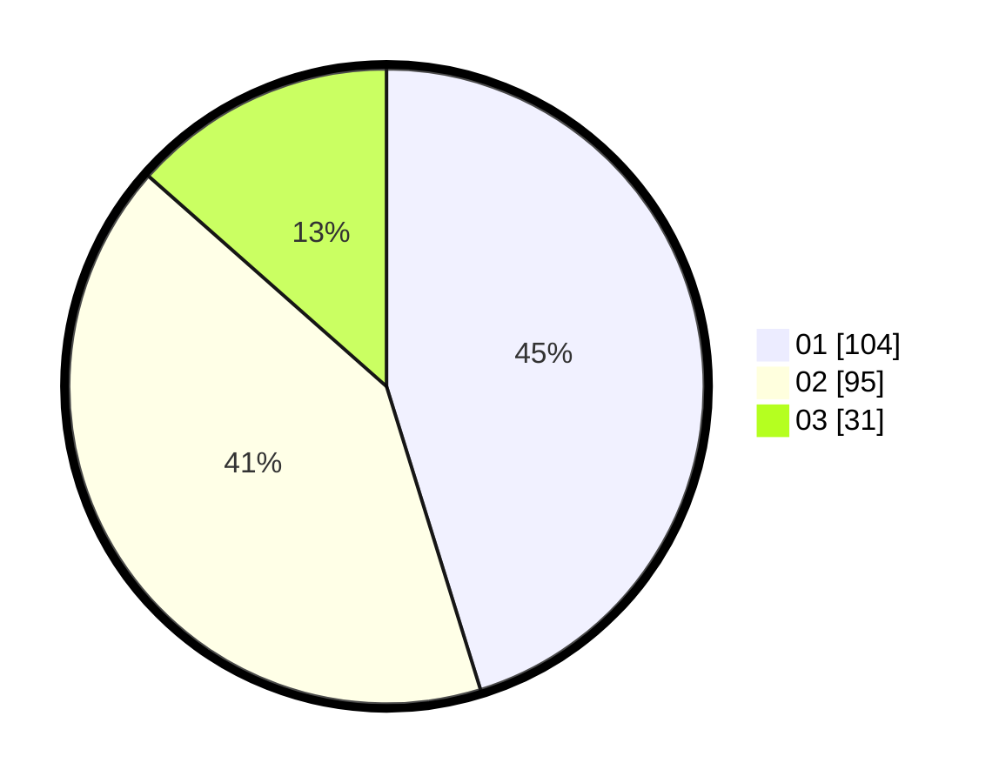

# Hasil

Hasil perolehan suara paslon dapat dilihat pada file paslon-01.txt, paslon-02.txt, dan paslon-03.txt.

Jika tidak ada, artinya data tersebut belum ada pada SIREKAP.

## Perolehan Suara

 * Paslon 01: **104**.
 * Paslon 02: **95**.
 * Paslon 03: **31**.

## Foto C Plano

https://sirekap-obj-formc.kpu.go.id/6ce4/pemilu/ppwp/31/75/04/10/02/3175041002001-20240215-210348--00b6e4f1-ba3f-41c1-b693-010e6daec8fb.jpg

https://sirekap-obj-formc.kpu.go.id/6ce4/pemilu/ppwp/31/75/04/10/02/3175041002001-20240215-210729--49ba9ae5-592f-4a75-980c-8396ae25c829.jpg

https://sirekap-obj-formc.kpu.go.id/6ce4/pemilu/ppwp/31/75/04/10/02/3175041002001-20240215-210955--1a874bf9-aeb3-4d67-9a07-eeaf09406cc2.jpg
