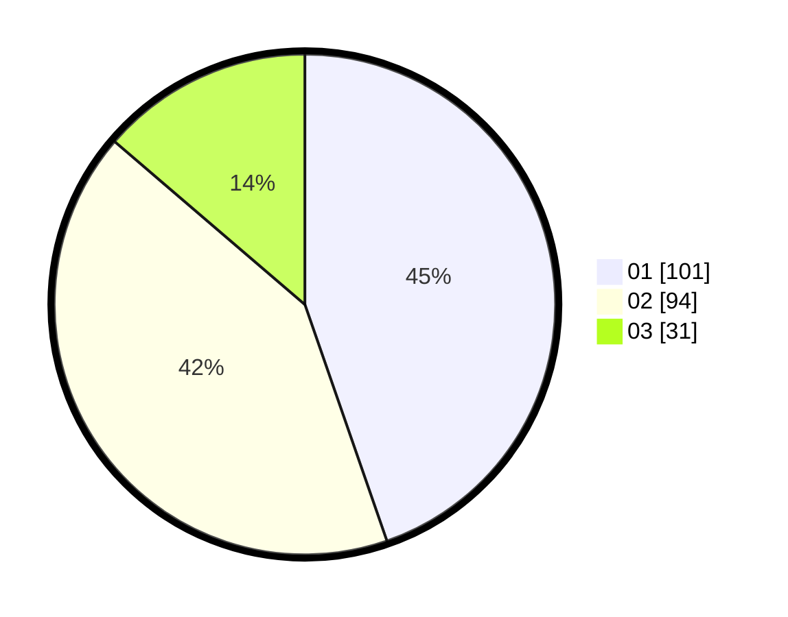

# Hasil

Hasil perolehan suara paslon dapat dilihat pada file paslon-01.txt, paslon-02.txt, dan paslon-03.txt.

Jika tidak ada, artinya data tersebut belum ada pada SIREKAP.

## Perolehan Suara

 * Paslon 01: **101**.
 * Paslon 02: **94**.
 * Paslon 03: **31**.

## Foto C Plano

https://sirekap-obj-formc.kpu.go.id/1c83/pemilu/ppwp/31/75/04/10/02/3175041002002-20240217-180140--0b23237f-60ed-4834-b68b-9d72215b85e2.jpg

https://sirekap-obj-formc.kpu.go.id/1c83/pemilu/ppwp/31/75/04/10/02/3175041002002-20240217-180844--dc1e452d-b09e-471e-96f8-4237da4decba.jpg

https://sirekap-obj-formc.kpu.go.id/1c83/pemilu/ppwp/31/75/04/10/02/3175041002002-20240217-181723--71dbeb21-30cb-43ea-a2a3-55231f803088.jpg

## DATA PEMILIH TETAP

Jumlah pemilih dalam DPT: **277**.
 * L: **149**.
 * P: **128**.

## DATA PENGGUNA HAK PILIH

Jumlah pengguna hak pilih dalam DPT: **220**.
 * L: **110**.
 * P: **110**.

Jumlah pengguna hak pilih dalam DPTb: **4**.
 * L: **2**.
 * P: **2**.

Jumlah pengguna hak pilih dalam DPK: **3**.
 * L: **1**.
 * P: **2**.

Jumlah pengguna hak pilih: **227**.
 * L: **113**.
 * P: **114**.

## JUMLAH SUARA SAH DAN TIDAK SAH

JUMLAH SELURUH SUARA SAH: **226**.

JUMLAH SUARA TIDAK SAH: **1**.

JUMLAH SELURUH SUARA SAH DAN SUARA TIDAK SAH: **227**.
