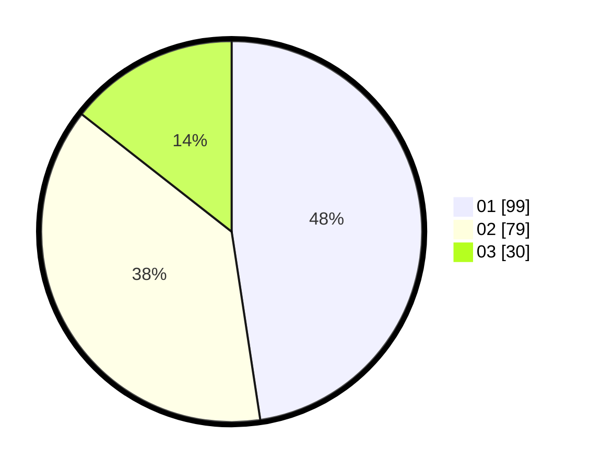

# Hasil

Hasil perolehan suara paslon dapat dilihat pada file paslon-01.txt, paslon-02.txt, dan paslon-03.txt.

Jika tidak ada, artinya data tersebut belum ada pada SIREKAP.

## Perolehan Suara

 * Paslon 01: **99**.
 * Paslon 02: **79**.
 * Paslon 03: **30**.

## Foto C Plano

https://sirekap-obj-formc.kpu.go.id/1de0/pemilu/ppwp/31/75/04/10/02/3175041002005-20240219-075843--ac81a97a-fabb-45ca-afac-4e988736ec57.jpg

https://sirekap-obj-formc.kpu.go.id/1de0/pemilu/ppwp/31/75/04/10/02/3175041002005-20240219-114932--e594f1d1-95cc-48b5-882f-d97ec5f5198f.jpg

https://sirekap-obj-formc.kpu.go.id/1de0/pemilu/ppwp/31/75/04/10/02/3175041002005-20240219-081428--4160e2c1-546d-47d9-b02a-d6334026c045.jpg

## DATA PEMILIH TETAP

Jumlah pemilih dalam DPT: **283**.
 * L: **134**.
 * P: **149**.

## DATA PENGGUNA HAK PILIH

Jumlah pengguna hak pilih dalam DPT: **207**.
 * L: **96**.
 * P: **111**.

Jumlah pengguna hak pilih dalam DPTb: **1**.
 * L: **0**.
 * P: **1**.

Jumlah pengguna hak pilih dalam DPK: **0**.
 * L: **0**.
 * P: **0**.

Jumlah pengguna hak pilih: **208**.
 * L: **96**.
 * P: **112**.

## JUMLAH SUARA SAH DAN TIDAK SAH

JUMLAH SELURUH SUARA SAH: **208**.

JUMLAH SUARA TIDAK SAH: **0**.

JUMLAH SELURUH SUARA SAH DAN SUARA TIDAK SAH: **208**.
