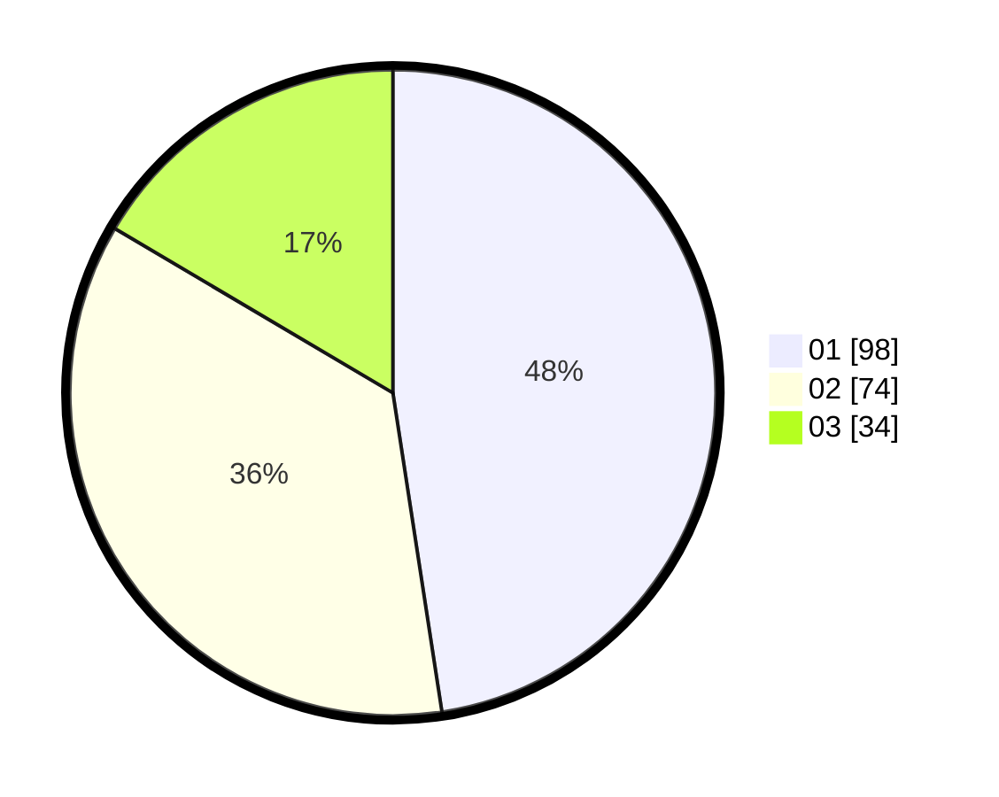

# Hasil

Hasil perolehan suara paslon dapat dilihat pada file paslon-01.txt, paslon-02.txt, dan paslon-03.txt.

Jika tidak ada, artinya data tersebut belum ada pada SIREKAP.

## Perolehan Suara

 * Paslon 01: **98**.
 * Paslon 02: **74**.
 * Paslon 03: **34**.

## Foto C Plano

https://sirekap-obj-formc.kpu.go.id/30da/pemilu/ppwp/31/75/04/10/02/3175041002011-20240217-140730--8ea1c664-220c-48ab-b3de-23b66769e482.jpg

https://sirekap-obj-formc.kpu.go.id/30da/pemilu/ppwp/31/75/04/10/02/3175041002011-20240217-141200--1bb14661-1d2d-4a6d-976e-85407b53d218.jpg

https://sirekap-obj-formc.kpu.go.id/30da/pemilu/ppwp/31/75/04/10/02/3175041002011-20240217-141607--7fc98527-c2cb-4d6b-ac1e-297eac2468bd.jpg

## DATA PEMILIH TETAP

Jumlah pemilih dalam DPT: **264**.
 * L: **129**.
 * P: **135**.

## DATA PENGGUNA HAK PILIH

Jumlah pengguna hak pilih dalam DPT: **192**.
 * L: **92**.
 * P: **100**.

Jumlah pengguna hak pilih dalam DPTb: **14**.
 * L: **7**.
 * P: **7**.

Jumlah pengguna hak pilih dalam DPK: **2**.
 * L: **2**.
 * P: **0**.

Jumlah pengguna hak pilih: **208**.
 * L: **101**.
 * P: **107**.

## JUMLAH SUARA SAH DAN TIDAK SAH

JUMLAH SELURUH SUARA SAH: **206**.

JUMLAH SUARA TIDAK SAH: **2**.

JUMLAH SELURUH SUARA SAH DAN SUARA TIDAK SAH: **208**.
