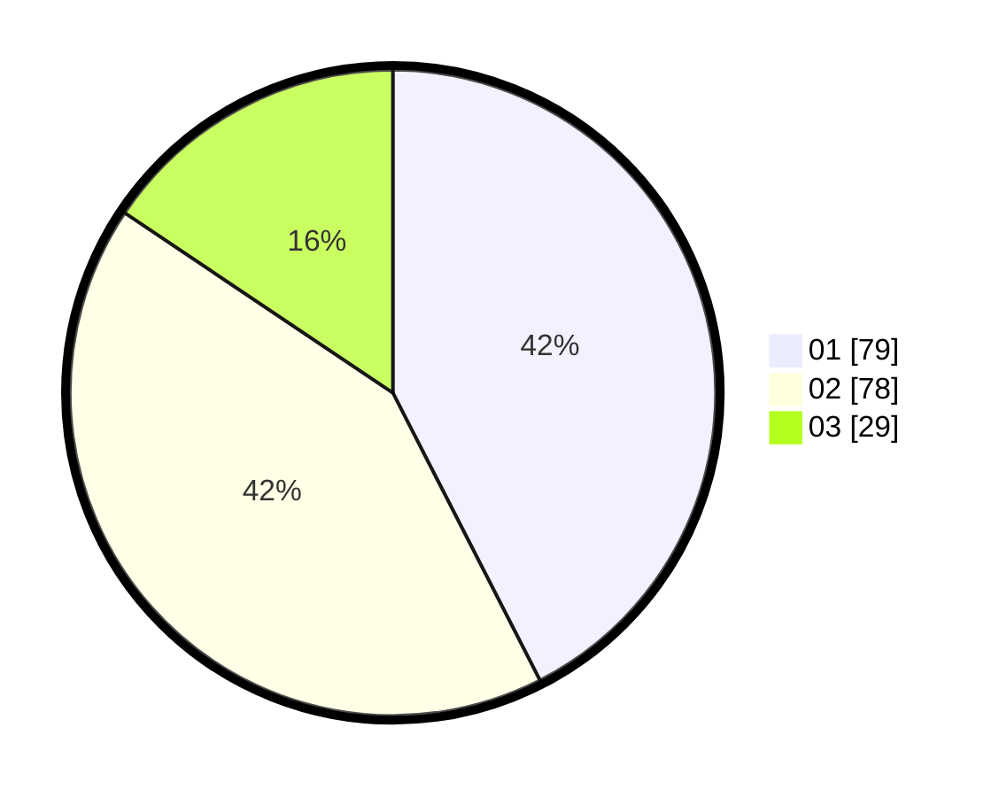

# Hasil

Hasil perolehan suara paslon dapat dilihat pada file paslon-01.txt, paslon-02.txt, dan paslon-03.txt.

Jika tidak ada, artinya data tersebut belum ada pada SIREKAP.

## Perolehan Suara

 * Paslon 01: **79**.
 * Paslon 02: **78**.
 * Paslon 03: **29**.

## Foto C Plano

https://sirekap-obj-formc.kpu.go.id/11a6/pemilu/ppwp/31/75/04/10/02/3175041002013-20240217-122402--f331eb6e-957d-470b-8126-d04766d22cd7.jpg

https://sirekap-obj-formc.kpu.go.id/11a6/pemilu/ppwp/31/75/04/10/02/3175041002013-20240217-121250--50f5979d-a1c7-41f8-a8df-c14c558d0890.jpg

https://sirekap-obj-formc.kpu.go.id/11a6/pemilu/ppwp/31/75/04/10/02/3175041002013-20240217-133732--e2578e10-e2c4-4374-bf7c-2dcafc4fd5bf.jpg

## DATA PEMILIH TETAP

Jumlah pemilih dalam DPT: **256**.
 * L: **131**.
 * P: **125**.

## DATA PENGGUNA HAK PILIH

Jumlah pengguna hak pilih dalam DPT: **183**.
 * L: **88**.
 * P: **95**.

Jumlah pengguna hak pilih dalam DPTb: **3**.
 * L: **1**.
 * P: **2**.

Jumlah pengguna hak pilih dalam DPK: **1**.
 * L: **1**.
 * P: **0**.

Jumlah pengguna hak pilih: **187**.
 * L: **90**.
 * P: **97**.

## JUMLAH SUARA SAH DAN TIDAK SAH

JUMLAH SELURUH SUARA SAH: **186**.

JUMLAH SUARA TIDAK SAH: **1**.

JUMLAH SELURUH SUARA SAH DAN SUARA TIDAK SAH: **187**.
