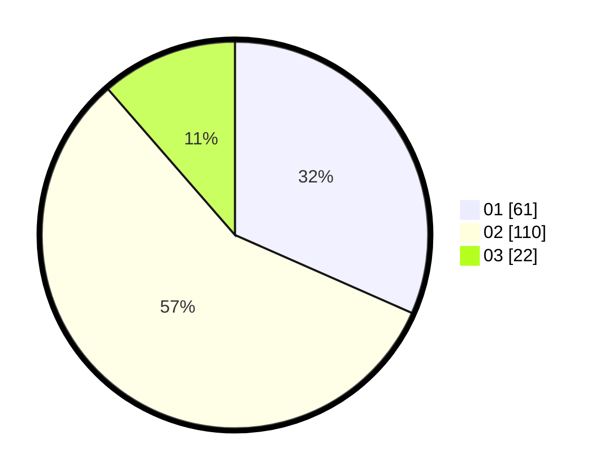

# Hasil

Hasil perolehan suara paslon dapat dilihat pada file paslon-01.txt, paslon-02.txt, dan paslon-03.txt.

Jika tidak ada, artinya data tersebut belum ada pada SIREKAP.

## Perolehan Suara

 * Paslon 01: **61**.
 * Paslon 02: **110**.
 * Paslon 03: **22**.

## Foto C Plano

https://sirekap-obj-formc.kpu.go.id/939e/pemilu/ppwp/31/75/04/10/02/3175041002016-20240217-104916--439aad7b-46d7-45d8-b448-a84ed5532a66.jpg

https://sirekap-obj-formc.kpu.go.id/939e/pemilu/ppwp/31/75/04/10/02/3175041002016-20240217-105024--ae0d1f3e-ab2a-4294-a255-a8aa5a4b6f30.jpg

https://sirekap-obj-formc.kpu.go.id/939e/pemilu/ppwp/31/75/04/10/02/3175041002016-20240217-105116--bd0a994c-de1e-4e88-ae85-2bf76f8c68fd.jpg

## DATA PEMILIH TETAP

Jumlah pemilih dalam DPT: **259**.
 * L: **138**.
 * P: **120**.

## DATA PENGGUNA HAK PILIH

Jumlah pengguna hak pilih dalam DPT: **194**.
 * L: **98**.
 * P: **96**.

Jumlah pengguna hak pilih dalam DPTb: **0**.
 * L: **0**.
 * P: **0**.

Jumlah pengguna hak pilih dalam DPK: **0**.
 * L: **0**.
 * P: **0**.

Jumlah pengguna hak pilih: **194**.
 * L: **98**.
 * P: **96**.

## JUMLAH SUARA SAH DAN TIDAK SAH

JUMLAH SELURUH SUARA SAH: **193**.

JUMLAH SUARA TIDAK SAH: **1**.

JUMLAH SELURUH SUARA SAH DAN SUARA TIDAK SAH: **194**.
