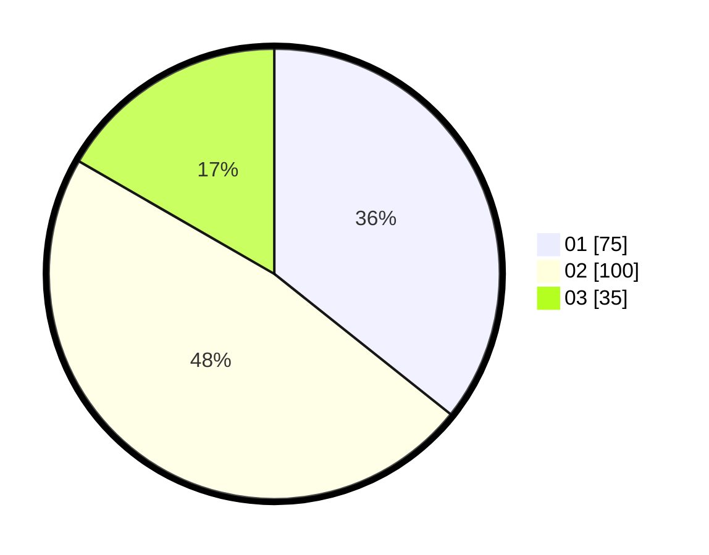

# Hasil

Hasil perolehan suara paslon dapat dilihat pada file paslon-01.txt, paslon-02.txt, dan paslon-03.txt.

Jika tidak ada, artinya data tersebut belum ada pada SIREKAP.

## Perolehan Suara

 * Paslon 01: **75**.
 * Paslon 02: **100**.
 * Paslon 03: **35**.

## Foto C Plano

https://sirekap-obj-formc.kpu.go.id/fd25/pemilu/ppwp/31/75/04/10/02/3175041002021-20240217-220523--38ca6e1e-a7d3-4b2a-89e6-8d0e1427665d.jpg

https://sirekap-obj-formc.kpu.go.id/fd25/pemilu/ppwp/31/75/04/10/02/3175041002021-20240217-125412--28a76362-90d8-4bd9-a392-4e0e6ebdd706.jpg

https://sirekap-obj-formc.kpu.go.id/fd25/pemilu/ppwp/31/75/04/10/02/3175041002021-20240217-125502--ff394388-4dab-471d-92c8-83180bcab231.jpg

## DATA PEMILIH TETAP

Jumlah pemilih dalam DPT: **280**.
 * L: **142**.
 * P: **138**.

## DATA PENGGUNA HAK PILIH

Jumlah pengguna hak pilih dalam DPT: **211**.
 * L: **106**.
 * P: **105**.

Jumlah pengguna hak pilih dalam DPTb: **0**.
 * L: **0**.
 * P: **0**.

Jumlah pengguna hak pilih dalam DPK: **1**.
 * L: **0**.
 * P: **1**.

Jumlah pengguna hak pilih: **212**.
 * L: **106**.
 * P: **106**.

## JUMLAH SUARA SAH DAN TIDAK SAH

JUMLAH SELURUH SUARA SAH: **210**.

JUMLAH SUARA TIDAK SAH: **2**.

JUMLAH SELURUH SUARA SAH DAN SUARA TIDAK SAH: **212**.
