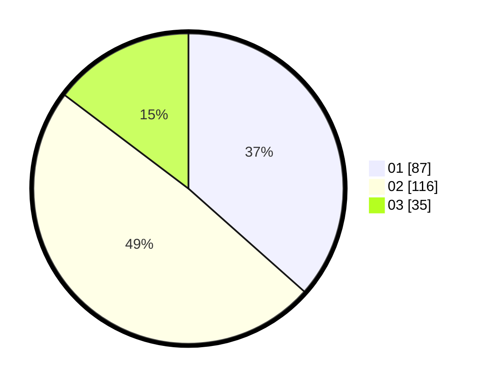

# Hasil

Hasil perolehan suara paslon dapat dilihat pada file paslon-01.txt, paslon-02.txt, dan paslon-03.txt.

Jika tidak ada, artinya data tersebut belum ada pada SIREKAP.

## Perolehan Suara

 * Paslon 01: **87**.
 * Paslon 02: **116**.
 * Paslon 03: **35**.

## Foto C Plano

https://sirekap-obj-formc.kpu.go.id/8faf/pemilu/ppwp/31/75/04/10/02/3175041002022-20240215-133655--d2452d27-e865-4465-bfe1-18c9445d9c17.jpg

https://sirekap-obj-formc.kpu.go.id/8faf/pemilu/ppwp/31/75/04/10/02/3175041002022-20240215-231348--4a0155f3-277e-4b7d-b6f9-eda7d89c2e95.jpg

https://sirekap-obj-formc.kpu.go.id/8faf/pemilu/ppwp/31/75/04/10/02/3175041002022-20240215-231800--955c7077-6d39-4f08-a67c-b9924db66d72.jpg

## DATA PEMILIH TETAP

Jumlah pemilih dalam DPT: **288**.
 * L: **131**.
 * P: **157**.

## DATA PENGGUNA HAK PILIH

Jumlah pengguna hak pilih dalam DPT: **238**.
 * L: **105**.
 * P: **133**.

Jumlah pengguna hak pilih dalam DPTb: **3**.
 * L: **1**.
 * P: **2**.

Jumlah pengguna hak pilih dalam DPK: **1**.
 * L: **0**.
 * P: **1**.

Jumlah pengguna hak pilih: **242**.
 * L: **106**.
 * P: **136**.

## JUMLAH SUARA SAH DAN TIDAK SAH

JUMLAH SELURUH SUARA SAH: **238**.

JUMLAH SUARA TIDAK SAH: **4**.

JUMLAH SELURUH SUARA SAH DAN SUARA TIDAK SAH: **242**.
