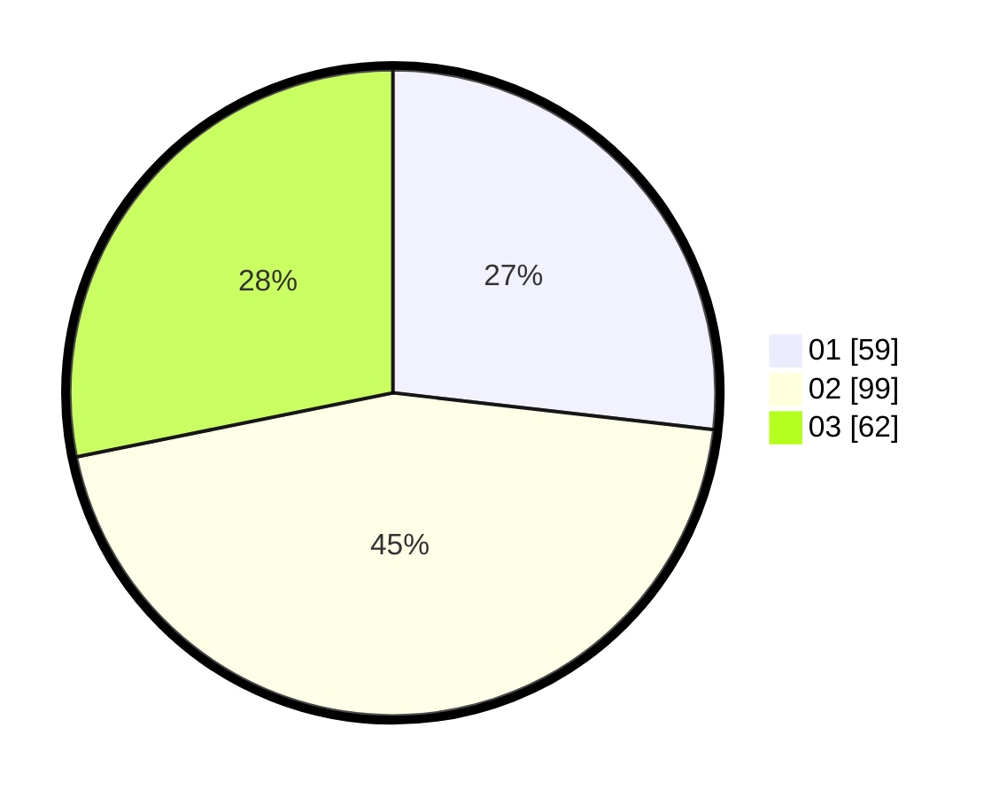

# Hasil

Hasil perolehan suara paslon dapat dilihat pada file paslon-01.txt, paslon-02.txt, dan paslon-03.txt.

Jika tidak ada, artinya data tersebut belum ada pada SIREKAP.

## Perolehan Suara

 * Paslon 01: **59**.
 * Paslon 02: **99**.
 * Paslon 03: **62**.

## Foto C Plano

https://sirekap-obj-formc.kpu.go.id/102a/pemilu/ppwp/31/75/04/10/02/3175041002025-20240214-230841--3b06e4d2-7996-439c-a18f-13ce19d23216.jpg

https://sirekap-obj-formc.kpu.go.id/102a/pemilu/ppwp/31/75/04/10/02/3175041002025-20240214-230911--2852580c-0e52-4114-bf23-fcdbff3158a0.jpg

https://sirekap-obj-formc.kpu.go.id/102a/pemilu/ppwp/31/75/04/10/02/3175041002025-20240214-230930--be2eefcf-b255-4689-945d-07df1621702d.jpg
