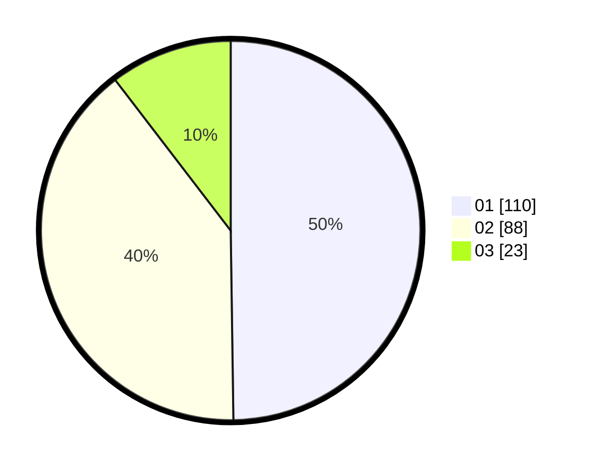

# Hasil

Hasil perolehan suara paslon dapat dilihat pada file paslon-01.txt, paslon-02.txt, dan paslon-03.txt.

Jika tidak ada, artinya data tersebut belum ada pada SIREKAP.

## Perolehan Suara

 * Paslon 01: **110**.
 * Paslon 02: **88**.
 * Paslon 03: **23**.

## Foto C Plano

https://sirekap-obj-formc.kpu.go.id/4927/pemilu/ppwp/31/75/04/10/02/3175041002028-20240217-175552--4718a4c1-3d07-41b6-b47c-6c100f03d3ea.jpg

https://sirekap-obj-formc.kpu.go.id/4927/pemilu/ppwp/31/75/04/10/02/3175041002028-20240215-070406--05eae46a-605b-4780-b5e4-643abf88ba96.jpg

https://sirekap-obj-formc.kpu.go.id/4927/pemilu/ppwp/31/75/04/10/02/3175041002028-20240215-070538--513e6e61-196c-414a-840a-1f156bfeb916.jpg
