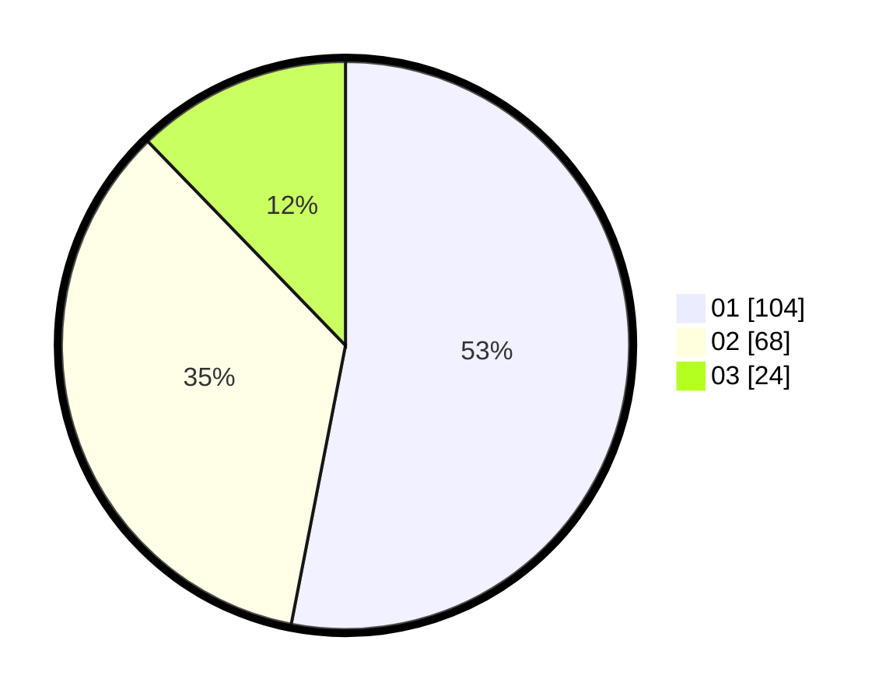

# Hasil

Hasil perolehan suara paslon dapat dilihat pada file paslon-01.txt, paslon-02.txt, dan paslon-03.txt.

Jika tidak ada, artinya data tersebut belum ada pada SIREKAP.

## Perolehan Suara

 * Paslon 01: **104**.
 * Paslon 02: **68**.
 * Paslon 03: **24**.

## Foto C Plano

https://sirekap-obj-formc.kpu.go.id/a8f6/pemilu/ppwp/31/75/04/10/02/3175041002029-20240217-102308--1e18c597-9c9b-4e13-bb38-2bafdd8e19ce.jpg

https://sirekap-obj-formc.kpu.go.id/a8f6/pemilu/ppwp/31/75/04/10/02/3175041002029-20240217-110433--dcb3a322-19f1-4c3b-af6f-30231e131957.jpg

https://sirekap-obj-formc.kpu.go.id/a8f6/pemilu/ppwp/31/75/04/10/02/3175041002029-20240217-101727--91f361d3-677e-4142-99a7-b09f3ab88e9b.jpg

## DATA PEMILIH TETAP

Jumlah pemilih dalam DPT: **252**.
 * L: **128**.
 * P: **124**.

## DATA PENGGUNA HAK PILIH

Jumlah pengguna hak pilih dalam DPT: **198**.
 * L: **93**.
 * P: **105**.

Jumlah pengguna hak pilih dalam DPTb: **0**.
 * L: **0**.
 * P: **0**.

Jumlah pengguna hak pilih dalam DPK: **0**.
 * L: **0**.
 * P: **0**.

Jumlah pengguna hak pilih: **198**.
 * L: **93**.
 * P: **105**.

## JUMLAH SUARA SAH DAN TIDAK SAH

JUMLAH SELURUH SUARA SAH: **196**.

JUMLAH SUARA TIDAK SAH: **2**.

JUMLAH SELURUH SUARA SAH DAN SUARA TIDAK SAH: **198**.
