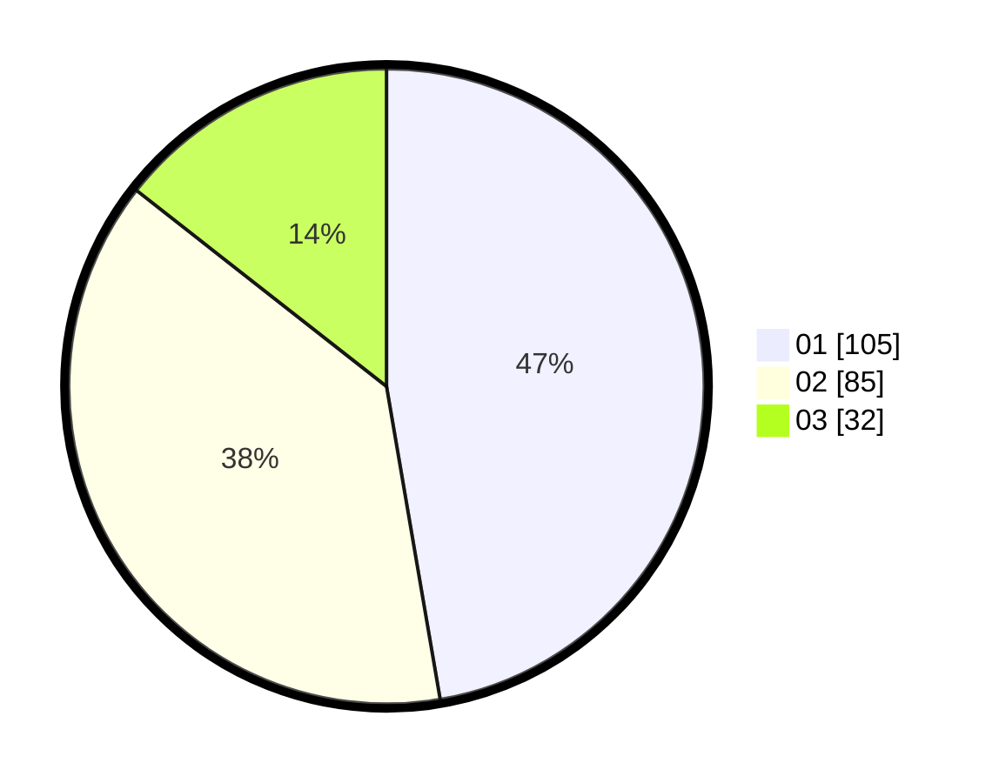

# Hasil

Hasil perolehan suara paslon dapat dilihat pada file paslon-01.txt, paslon-02.txt, dan paslon-03.txt.

Jika tidak ada, artinya data tersebut belum ada pada SIREKAP.

## Perolehan Suara

 * Paslon 01: **105**.
 * Paslon 02: **85**.
 * Paslon 03: **32**.

## Foto C Plano

https://sirekap-obj-formc.kpu.go.id/cd59/pemilu/ppwp/31/75/04/10/02/3175041002034-20240216-140536--ac4626dc-62f8-4e77-8506-1d9337c9dee6.jpg

https://sirekap-obj-formc.kpu.go.id/cd59/pemilu/ppwp/31/75/04/10/02/3175041002034-20240217-120918--20a5bcd6-e7f8-4ea5-b4f8-1b0fbc4a3b0f.jpg

https://sirekap-obj-formc.kpu.go.id/cd59/pemilu/ppwp/31/75/04/10/02/3175041002034-20240216-141311--8abf6881-22f3-44d0-ad56-54ac93b3b7db.jpg

## DATA PEMILIH TETAP

Jumlah pemilih dalam DPT: **278**.
 * L: **126**.
 * P: **152**.

## DATA PENGGUNA HAK PILIH

Jumlah pengguna hak pilih dalam DPT: **218**.
 * L: **96**.
 * P: **122**.

Jumlah pengguna hak pilih dalam DPTb: **0**.
 * L: **0**.
 * P: **0**.

Jumlah pengguna hak pilih dalam DPK: **8**.
 * L: **5**.
 * P: **3**.

Jumlah pengguna hak pilih: **226**.
 * L: **101**.
 * P: **125**.

## JUMLAH SUARA SAH DAN TIDAK SAH

JUMLAH SELURUH SUARA SAH: **222**.

JUMLAH SUARA TIDAK SAH: **4**.

JUMLAH SELURUH SUARA SAH DAN SUARA TIDAK SAH: **226**.
