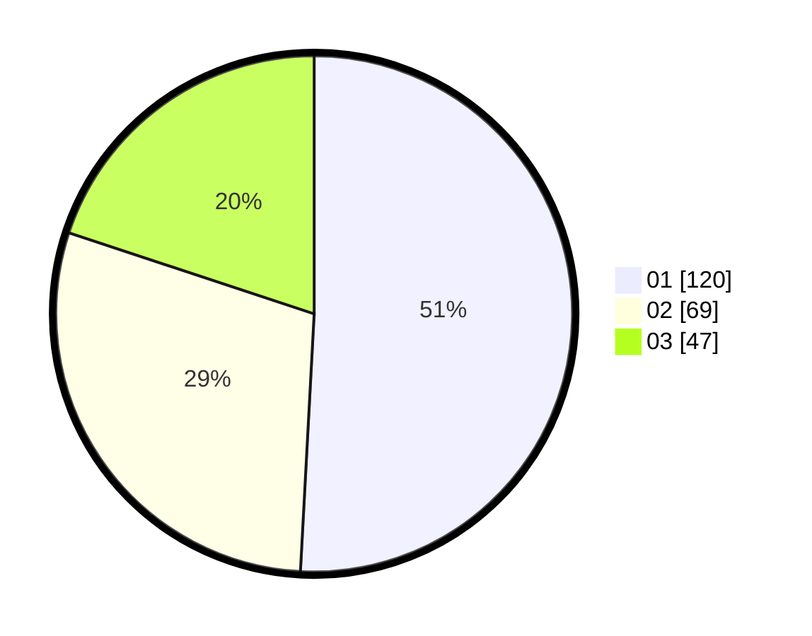

# Hasil

Hasil perolehan suara paslon dapat dilihat pada file paslon-01.txt, paslon-02.txt, dan paslon-03.txt.

Jika tidak ada, artinya data tersebut belum ada pada SIREKAP.

## Perolehan Suara

 * Paslon 01: **120**.
 * Paslon 02: **69**.
 * Paslon 03: **47**.

## Foto C Plano

https://sirekap-obj-formc.kpu.go.id/dff4/pemilu/ppwp/31/75/04/10/02/3175041002035-20240217-133355--3f00b419-a600-41cd-aa3f-9f1ea273f830.jpg

https://sirekap-obj-formc.kpu.go.id/dff4/pemilu/ppwp/31/75/04/10/02/3175041002035-20240217-150611--9057a664-0a68-4eab-a9f2-a5d89c7338bd.jpg

https://sirekap-obj-formc.kpu.go.id/dff4/pemilu/ppwp/31/75/04/10/02/3175041002035-20240217-140942--7e06c93a-0f6a-419d-a284-4e337a27b868.jpg

## DATA PEMILIH TETAP

Jumlah pemilih dalam DPT: **274**.
 * L: **145**.
 * P: **129**.

## DATA PENGGUNA HAK PILIH

Jumlah pengguna hak pilih dalam DPT: **237**.
 * L: **121**.
 * P: **116**.

Jumlah pengguna hak pilih dalam DPTb: **1**.
 * L: **0**.
 * P: **1**.

Jumlah pengguna hak pilih dalam DPK: **2**.
 * L: **1**.
 * P: **1**.

Jumlah pengguna hak pilih: **240**.
 * L: **122**.
 * P: **118**.

## JUMLAH SUARA SAH DAN TIDAK SAH

JUMLAH SELURUH SUARA SAH: **236**.

JUMLAH SUARA TIDAK SAH: **4**.

JUMLAH SELURUH SUARA SAH DAN SUARA TIDAK SAH: **240**.
