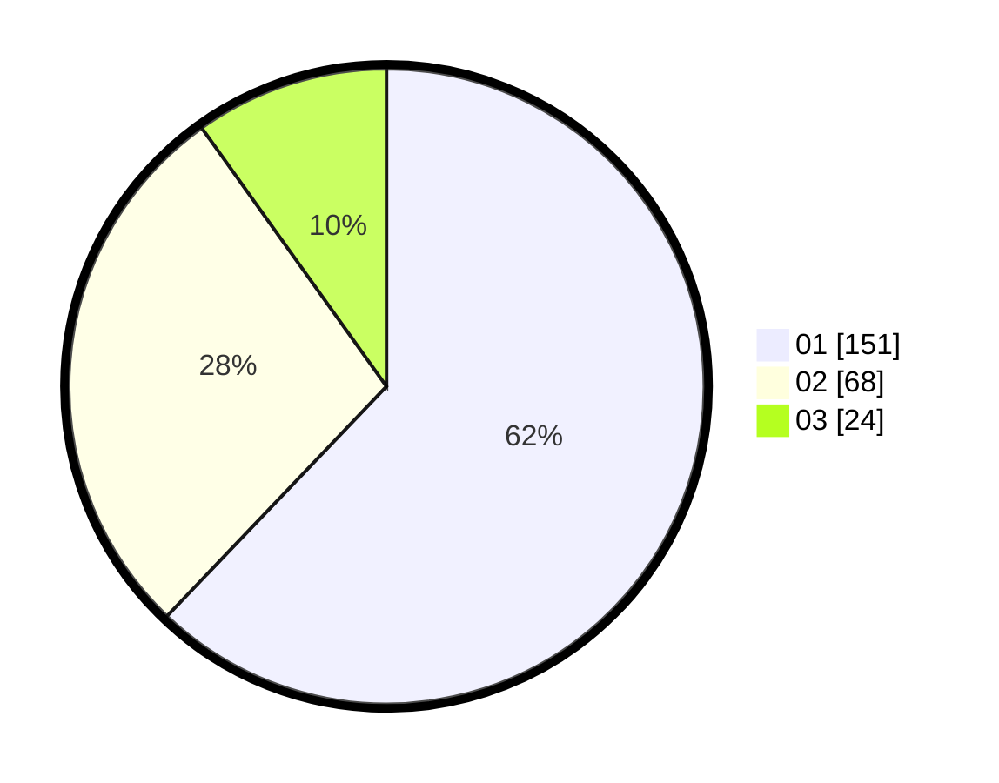

# Hasil

Hasil perolehan suara paslon dapat dilihat pada file paslon-01.txt, paslon-02.txt, dan paslon-03.txt.

Jika tidak ada, artinya data tersebut belum ada pada SIREKAP.

## Perolehan Suara

 * Paslon 01: **151**.
 * Paslon 02: **68**.
 * Paslon 03: **24**.

## Foto C Plano

https://sirekap-obj-formc.kpu.go.id/6cbd/pemilu/ppwp/31/75/04/10/02/3175041002037-20240216-205742--ae33ebe1-3587-4b72-ab74-cc2b269d0b23.jpg

https://sirekap-obj-formc.kpu.go.id/6cbd/pemilu/ppwp/31/75/04/10/02/3175041002037-20240216-211035--c9f59d12-ea0e-41af-834b-5a1c841e3107.jpg

https://sirekap-obj-formc.kpu.go.id/6cbd/pemilu/ppwp/31/75/04/10/02/3175041002037-20240216-212922--d48f876b-2b04-4c5b-badd-0a05c3dbe15a.jpg

## DATA PEMILIH TETAP

Jumlah pemilih dalam DPT: **285**.
 * L: **136**.
 * P: **149**.

## DATA PENGGUNA HAK PILIH

Jumlah pengguna hak pilih dalam DPT: **231**.
 * L: **103**.
 * P: **128**.

Jumlah pengguna hak pilih dalam DPTb: **11**.
 * L: **1**.
 * P: **10**.

Jumlah pengguna hak pilih dalam DPK: **3**.
 * L: **2**.
 * P: **1**.

Jumlah pengguna hak pilih: **245**.
 * L: **106**.
 * P: **139**.

## JUMLAH SUARA SAH DAN TIDAK SAH

JUMLAH SELURUH SUARA SAH: **243**.

JUMLAH SUARA TIDAK SAH: **2**.

JUMLAH SELURUH SUARA SAH DAN SUARA TIDAK SAH: **245**.
