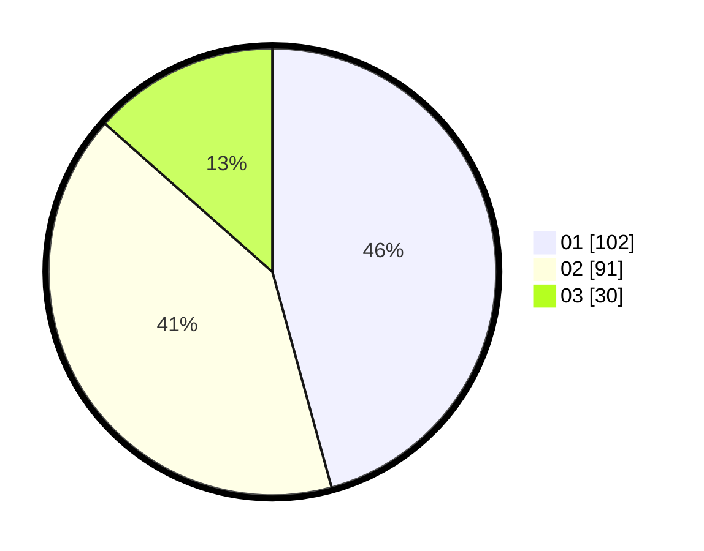

# Hasil

Hasil perolehan suara paslon dapat dilihat pada file paslon-01.txt, paslon-02.txt, dan paslon-03.txt.

Jika tidak ada, artinya data tersebut belum ada pada SIREKAP.

## Perolehan Suara

 * Paslon 01: **102**.
 * Paslon 02: **91**.
 * Paslon 03: **30**.

## Foto C Plano

https://sirekap-obj-formc.kpu.go.id/3072/pemilu/ppwp/31/75/04/10/02/3175041002047-20240218-190626--0520e64c-c053-4210-9e82-47e585e2a7e8.jpg

https://sirekap-obj-formc.kpu.go.id/3072/pemilu/ppwp/31/75/04/10/02/3175041002047-20240217-105717--08317c6a-0f20-48d1-8399-5fca1bcd6922.jpg

https://sirekap-obj-formc.kpu.go.id/3072/pemilu/ppwp/31/75/04/10/02/3175041002047-20240217-105721--44b5a900-1d70-4c1d-9d48-a011c3f7250e.jpg

## DATA PEMILIH TETAP

Jumlah pemilih dalam DPT: **274**.
 * L: **131**.
 * P: **143**.

## DATA PENGGUNA HAK PILIH

Jumlah pengguna hak pilih dalam DPT: **221**.
 * L: **106**.
 * P: **115**.

Jumlah pengguna hak pilih dalam DPTb: **6**.
 * L: **2**.
 * P: **4**.

Jumlah pengguna hak pilih dalam DPK: **0**.
 * L: **0**.
 * P: **0**.

Jumlah pengguna hak pilih: **227**.
 * L: **108**.
 * P: **119**.

## JUMLAH SUARA SAH DAN TIDAK SAH

JUMLAH SELURUH SUARA SAH: **223**.

JUMLAH SUARA TIDAK SAH: **4**.

JUMLAH SELURUH SUARA SAH DAN SUARA TIDAK SAH: **227**.
