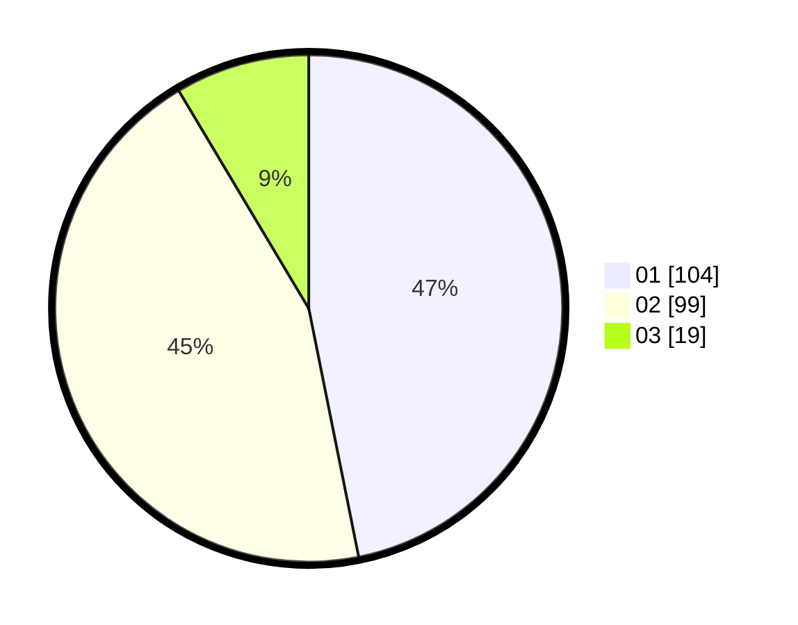

# Hasil

Hasil perolehan suara paslon dapat dilihat pada file paslon-01.txt, paslon-02.txt, dan paslon-03.txt.

Jika tidak ada, artinya data tersebut belum ada pada SIREKAP.

## Perolehan Suara

 * Paslon 01: **104**.
 * Paslon 02: **99**.
 * Paslon 03: **19**.

## Foto C Plano

https://sirekap-obj-formc.kpu.go.id/b439/pemilu/ppwp/31/75/04/10/02/3175041002049-20240216-174346--188ccbf3-eff8-4c8b-84f0-2bb272a279d3.jpg

https://sirekap-obj-formc.kpu.go.id/b439/pemilu/ppwp/31/75/04/10/02/3175041002049-20240216-191245--2d9d5465-6160-4741-8626-a505e402d006.jpg

https://sirekap-obj-formc.kpu.go.id/b439/pemilu/ppwp/31/75/04/10/02/3175041002049-20240216-174525--328e694c-7b33-44ee-9615-a11950ba9550.jpg

## DATA PEMILIH TETAP

Jumlah pemilih dalam DPT: **267**.
 * L: **131**.
 * P: **136**.

## DATA PENGGUNA HAK PILIH

Jumlah pengguna hak pilih dalam DPT: **212**.
 * L: **99**.
 * P: **113**.

Jumlah pengguna hak pilih dalam DPTb: **0**.
 * L: **0**.
 * P: **0**.

Jumlah pengguna hak pilih dalam DPK: **13**.
 * L: **6**.
 * P: **7**.

Jumlah pengguna hak pilih: **225**.
 * L: **105**.
 * P: **120**.

## JUMLAH SUARA SAH DAN TIDAK SAH

JUMLAH SELURUH SUARA SAH: **222**.

JUMLAH SUARA TIDAK SAH: **3**.

JUMLAH SELURUH SUARA SAH DAN SUARA TIDAK SAH: **225**.
