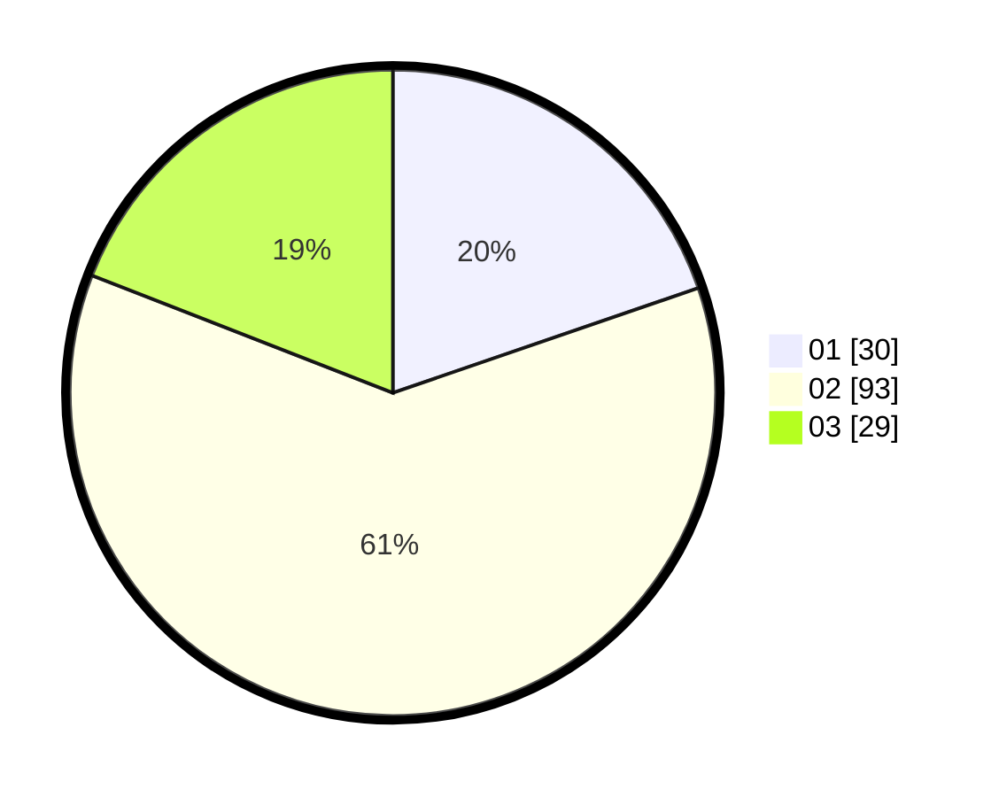

# Hasil

Hasil perolehan suara paslon dapat dilihat pada file paslon-01.txt, paslon-02.txt, dan paslon-03.txt.

Jika tidak ada, artinya data tersebut belum ada pada SIREKAP.

## Perolehan Suara

 * Paslon 01: **30**.
 * Paslon 02: **93**.
 * Paslon 03: **29**.

## Foto C Plano

https://sirekap-obj-formc.kpu.go.id/37fc/pemilu/ppwp/31/75/04/10/02/3175041002053-20240216-211712--dd47e5a6-6456-4897-a788-071581224983.jpg

https://sirekap-obj-formc.kpu.go.id/37fc/pemilu/ppwp/31/75/04/10/02/3175041002053-20240216-211818--6349a070-277d-4d71-b852-edb67235609e.jpg

https://sirekap-obj-formc.kpu.go.id/37fc/pemilu/ppwp/31/75/04/10/02/3175041002053-20240216-212255--ebdf194c-b5ca-4643-86da-d640b2cbabed.jpg

## DATA PEMILIH TETAP

Jumlah pemilih dalam DPT: **261**.
 * L: **123**.
 * P: **138**.

## DATA PENGGUNA HAK PILIH

Jumlah pengguna hak pilih dalam DPT: **153**.
 * L: **68**.
 * P: **85**.

Jumlah pengguna hak pilih dalam DPTb: **0**.
 * L: **0**.
 * P: **0**.

Jumlah pengguna hak pilih dalam DPK: **2**.
 * L: **1**.
 * P: **1**.

Jumlah pengguna hak pilih: **155**.
 * L: **69**.
 * P: **86**.

## JUMLAH SUARA SAH DAN TIDAK SAH

JUMLAH SELURUH SUARA SAH: **152**.

JUMLAH SUARA TIDAK SAH: **3**.

JUMLAH SELURUH SUARA SAH DAN SUARA TIDAK SAH: **155**.
