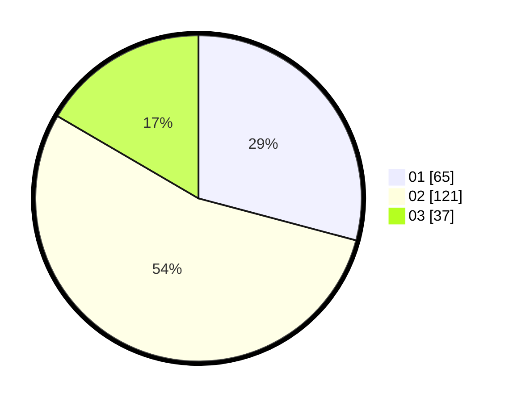

# Hasil

Hasil perolehan suara paslon dapat dilihat pada file paslon-01.txt, paslon-02.txt, dan paslon-03.txt.

Jika tidak ada, artinya data tersebut belum ada pada SIREKAP.

## Perolehan Suara

 * Paslon 01: **65**.
 * Paslon 02: **121**.
 * Paslon 03: **37**.

## Foto C Plano

https://sirekap-obj-formc.kpu.go.id/a05a/pemilu/ppwp/31/75/04/10/02/3175041002059-20240214-160129--3e74a1ea-48c3-4182-a391-ebbf74e2a0ac.jpg

https://sirekap-obj-formc.kpu.go.id/a05a/pemilu/ppwp/31/75/04/10/02/3175041002059-20240214-155710--c42f383b-91c6-449c-9420-67f8bbb7cb37.jpg

https://sirekap-obj-formc.kpu.go.id/a05a/pemilu/ppwp/31/75/04/10/02/3175041002059-20240214-155905--9351ee99-a915-4709-b683-5dcb1e6d4ccf.jpg
