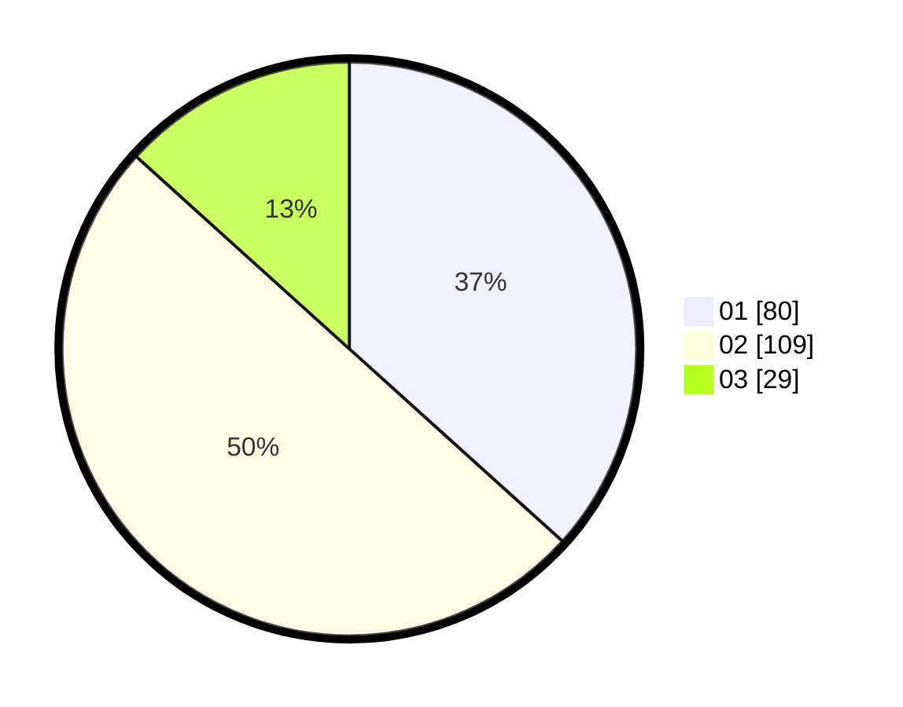

# Hasil

Hasil perolehan suara paslon dapat dilihat pada file paslon-01.txt, paslon-02.txt, dan paslon-03.txt.

Jika tidak ada, artinya data tersebut belum ada pada SIREKAP.

## Perolehan Suara

 * Paslon 01: **80**.
 * Paslon 02: **109**.
 * Paslon 03: **29**.

## Foto C Plano

https://sirekap-obj-formc.kpu.go.id/115b/pemilu/ppwp/31/75/04/10/02/3175041002062-20240214-185344--cde7d1c0-b765-498a-8b56-2b5a0fc8f63a.jpg

https://sirekap-obj-formc.kpu.go.id/115b/pemilu/ppwp/31/75/04/10/02/3175041002062-20240214-185349--357a17e9-d0da-4c89-a6a8-2b4e0a074ab0.jpg

https://sirekap-obj-formc.kpu.go.id/115b/pemilu/ppwp/31/75/04/10/02/3175041002062-20240214-185353--6fbcdd66-0808-4654-a1f7-7d34dd351387.jpg

## DATA PEMILIH TETAP

Jumlah pemilih dalam DPT: **286**.
 * L: **151**.
 * P: **135**.

## DATA PENGGUNA HAK PILIH

Jumlah pengguna hak pilih dalam DPT: **217**.
 * L: **109**.
 * P: **108**.

Jumlah pengguna hak pilih dalam DPTb: **1**.
 * L: **1**.
 * P: **0**.

Jumlah pengguna hak pilih dalam DPK: **6**.
 * L: **2**.
 * P: **4**.

Jumlah pengguna hak pilih: **224**.
 * L: **111**.
 * P: **113**.

## JUMLAH SUARA SAH DAN TIDAK SAH

JUMLAH SELURUH SUARA SAH: **218**.

JUMLAH SUARA TIDAK SAH: **6**.

JUMLAH SELURUH SUARA SAH DAN SUARA TIDAK SAH: **224**.
