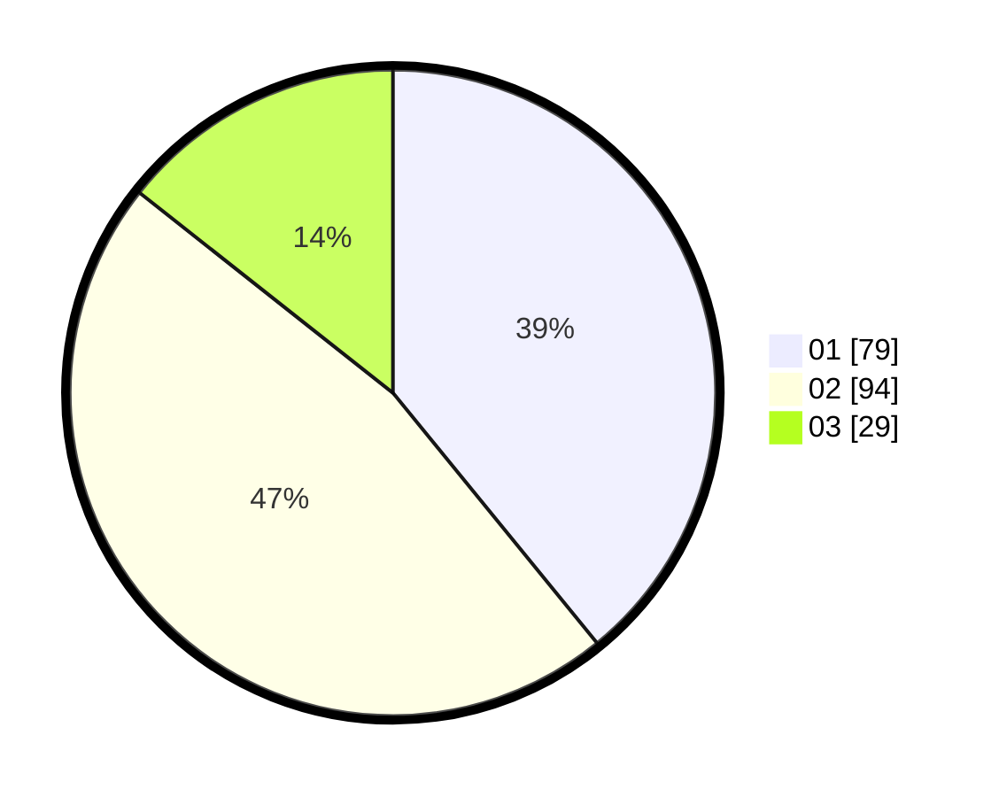

# Hasil

Hasil perolehan suara paslon dapat dilihat pada file paslon-01.txt, paslon-02.txt, dan paslon-03.txt.

Jika tidak ada, artinya data tersebut belum ada pada SIREKAP.

## Perolehan Suara

 * Paslon 01: **79**.
 * Paslon 02: **94**.
 * Paslon 03: **29**.

## Foto C Plano

https://sirekap-obj-formc.kpu.go.id/14bd/pemilu/ppwp/31/75/04/10/02/3175041002063-20240216-232825--6054b253-07f2-4575-99e2-b48e3f5b20dc.jpg

https://sirekap-obj-formc.kpu.go.id/14bd/pemilu/ppwp/31/75/04/10/02/3175041002063-20240217-144706--9ec29a5f-0e18-4d0d-8cf1-f06a3244b445.jpg

https://sirekap-obj-formc.kpu.go.id/14bd/pemilu/ppwp/31/75/04/10/02/3175041002063-20240216-234224--12aee6e5-ed6a-4362-b35c-99f3443dc41d.jpg

## DATA PEMILIH TETAP

Jumlah pemilih dalam DPT: **262**.
 * L: **131**.
 * P: **131**.

## DATA PENGGUNA HAK PILIH

Jumlah pengguna hak pilih dalam DPT: **198**.
 * L: **99**.
 * P: **99**.

Jumlah pengguna hak pilih dalam DPTb: **1**.
 * L: **0**.
 * P: **1**.

Jumlah pengguna hak pilih dalam DPK: **6**.
 * L: **2**.
 * P: **4**.

Jumlah pengguna hak pilih: **205**.
 * L: **101**.
 * P: **104**.

## JUMLAH SUARA SAH DAN TIDAK SAH

JUMLAH SELURUH SUARA SAH: **202**.

JUMLAH SUARA TIDAK SAH: **3**.

JUMLAH SELURUH SUARA SAH DAN SUARA TIDAK SAH: **205**.
