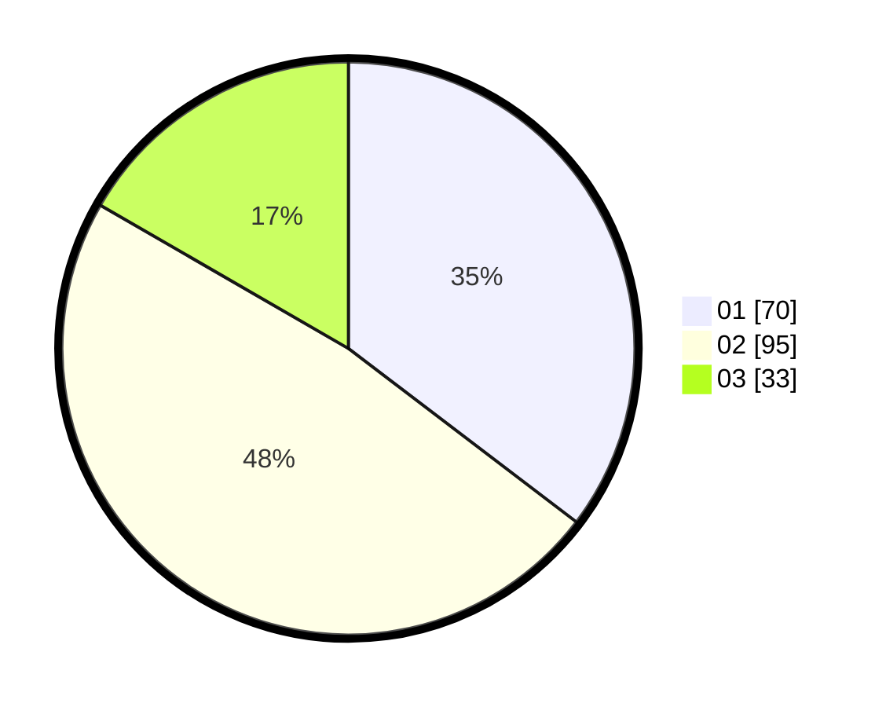

# Hasil

Hasil perolehan suara paslon dapat dilihat pada file paslon-01.txt, paslon-02.txt, dan paslon-03.txt.

Jika tidak ada, artinya data tersebut belum ada pada SIREKAP.

## Perolehan Suara

 * Paslon 01: **70**.
 * Paslon 02: **95**.
 * Paslon 03: **33**.

## Foto C Plano

https://sirekap-obj-formc.kpu.go.id/e793/pemilu/ppwp/31/75/04/10/02/3175041002065-20240217-213212--5101d67d-a192-4d73-9e64-25c38516a3fb.jpg

https://sirekap-obj-formc.kpu.go.id/e793/pemilu/ppwp/31/75/04/10/02/3175041002065-20240217-212001--a217cdef-841d-4e5b-bda8-d437d70ab643.jpg
