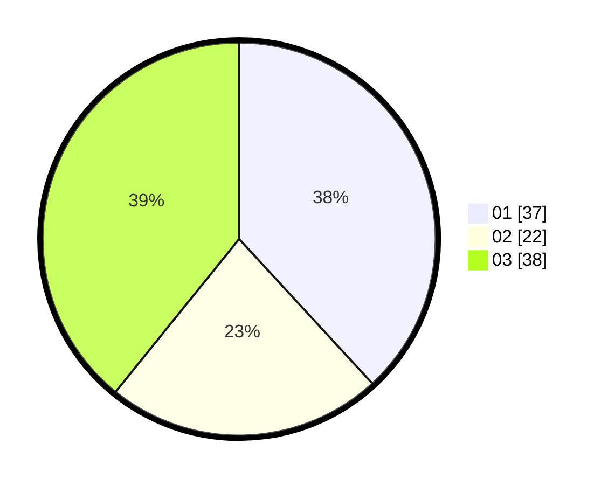

# Hasil

Hasil perolehan suara paslon dapat dilihat pada file paslon-01.txt, paslon-02.txt, dan paslon-03.txt.

Jika tidak ada, artinya data tersebut belum ada pada SIREKAP.

## Perolehan Suara

 * Paslon 01: **37**.
 * Paslon 02: **22**.
 * Paslon 03: **38**.

## Foto C Plano

https://sirekap-obj-formc.kpu.go.id/270f/pemilu/ppwp/31/75/04/10/02/3175041002067-20240217-111757--26b40d26-99e9-43d7-b080-152651daaab5.jpg

https://sirekap-obj-formc.kpu.go.id/270f/pemilu/ppwp/31/75/04/10/02/3175041002067-20240217-111758--6deb92f4-139d-415e-9a37-3a80f6c5a52a.jpg

https://sirekap-obj-formc.kpu.go.id/270f/pemilu/ppwp/31/75/04/10/02/3175041002067-20240216-201701--ddd2c924-055b-4b32-9f94-c05055c42ed9.jpg

## DATA PEMILIH TETAP

Jumlah pemilih dalam DPT: **264**.
 * L: **127**.
 * P: **137**.

## DATA PENGGUNA HAK PILIH

Jumlah pengguna hak pilih dalam DPT: **197**.
 * L: **90**.
 * P: **107**.

Jumlah pengguna hak pilih dalam DPTb: **0**.
 * L: **0**.
 * P: **0**.

Jumlah pengguna hak pilih dalam DPK: **4**.
 * L: **3**.
 * P: **1**.

Jumlah pengguna hak pilih: **201**.
 * L: **93**.
 * P: **108**.

## JUMLAH SUARA SAH DAN TIDAK SAH

JUMLAH SELURUH SUARA SAH: **197**.

JUMLAH SUARA TIDAK SAH: **4**.

JUMLAH SELURUH SUARA SAH DAN SUARA TIDAK SAH: **201**.
