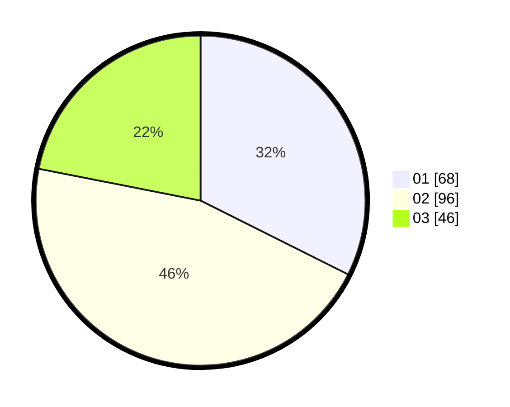

# Hasil

Hasil perolehan suara paslon dapat dilihat pada file paslon-01.txt, paslon-02.txt, dan paslon-03.txt.

Jika tidak ada, artinya data tersebut belum ada pada SIREKAP.

## Perolehan Suara

 * Paslon 01: **68**.
 * Paslon 02: **96**.
 * Paslon 03: **46**.

## Foto C Plano

https://sirekap-obj-formc.kpu.go.id/cace/pemilu/ppwp/31/75/04/10/02/3175041002070-20240216-074947--900d8878-5662-4c50-8fa5-21dc2cbbfe65.jpg

https://sirekap-obj-formc.kpu.go.id/cace/pemilu/ppwp/31/75/04/10/02/3175041002070-20240216-080741--3dc87bd4-7281-40bf-ab24-92909cce859a.jpg

https://sirekap-obj-formc.kpu.go.id/cace/pemilu/ppwp/31/75/04/10/02/3175041002070-20240216-075256--f08613b4-7e8d-491a-ac18-939b48d8f6fd.jpg

## DATA PEMILIH TETAP

Jumlah pemilih dalam DPT: **261**.
 * L: **138**.
 * P: **123**.

## DATA PENGGUNA HAK PILIH

Jumlah pengguna hak pilih dalam DPT: **213**.
 * L: **107**.
 * P: **106**.

Jumlah pengguna hak pilih dalam DPTb: **1**.
 * L: **1**.
 * P: **0**.

Jumlah pengguna hak pilih dalam DPK: **5**.
 * L: **4**.
 * P: **1**.

Jumlah pengguna hak pilih: **219**.
 * L: **112**.
 * P: **107**.

## JUMLAH SUARA SAH DAN TIDAK SAH

JUMLAH SELURUH SUARA SAH: **210**.

JUMLAH SUARA TIDAK SAH: **9**.

JUMLAH SELURUH SUARA SAH DAN SUARA TIDAK SAH: **219**.
