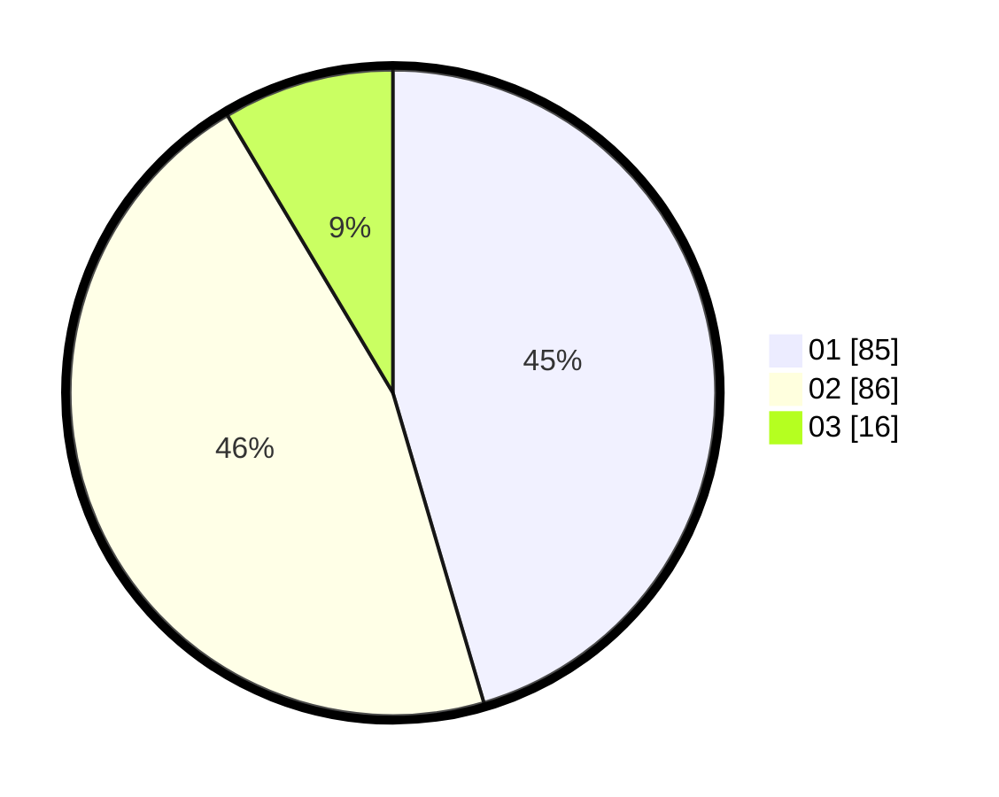

# Hasil

Hasil perolehan suara paslon dapat dilihat pada file paslon-01.txt, paslon-02.txt, dan paslon-03.txt.

Jika tidak ada, artinya data tersebut belum ada pada SIREKAP.

## Perolehan Suara

 * Paslon 01: **85**.
 * Paslon 02: **86**.
 * Paslon 03: **16**.

## Foto C Plano

https://sirekap-obj-formc.kpu.go.id/2d66/pemilu/ppwp/31/75/04/10/02/3175041002073-20240217-062022--4fbb88a4-fbbc-4203-b125-7b36c19818d9.jpg

https://sirekap-obj-formc.kpu.go.id/2d66/pemilu/ppwp/31/75/04/10/02/3175041002073-20240217-063210--1368598e-6012-4aca-bcca-25bd15810ac4.jpg

https://sirekap-obj-formc.kpu.go.id/2d66/pemilu/ppwp/31/75/04/10/02/3175041002073-20240215-223128--86c2b7cf-6178-4f62-af55-8fdfb6643f60.jpg

## DATA PEMILIH TETAP

Jumlah pemilih dalam DPT: **264**.
 * L: **132**.
 * P: **132**.

## DATA PENGGUNA HAK PILIH

Jumlah pengguna hak pilih dalam DPT: **184**.
 * L: **86**.
 * P: **98**.

Jumlah pengguna hak pilih dalam DPTb: **0**.
 * L: **0**.
 * P: **0**.

Jumlah pengguna hak pilih dalam DPK: **3**.
 * L: **1**.
 * P: **2**.

Jumlah pengguna hak pilih: **187**.
 * L: **87**.
 * P: **100**.

## JUMLAH SUARA SAH DAN TIDAK SAH

JUMLAH SELURUH SUARA SAH: **187**.

JUMLAH SUARA TIDAK SAH: **0**.

JUMLAH SELURUH SUARA SAH DAN SUARA TIDAK SAH: **187**.
