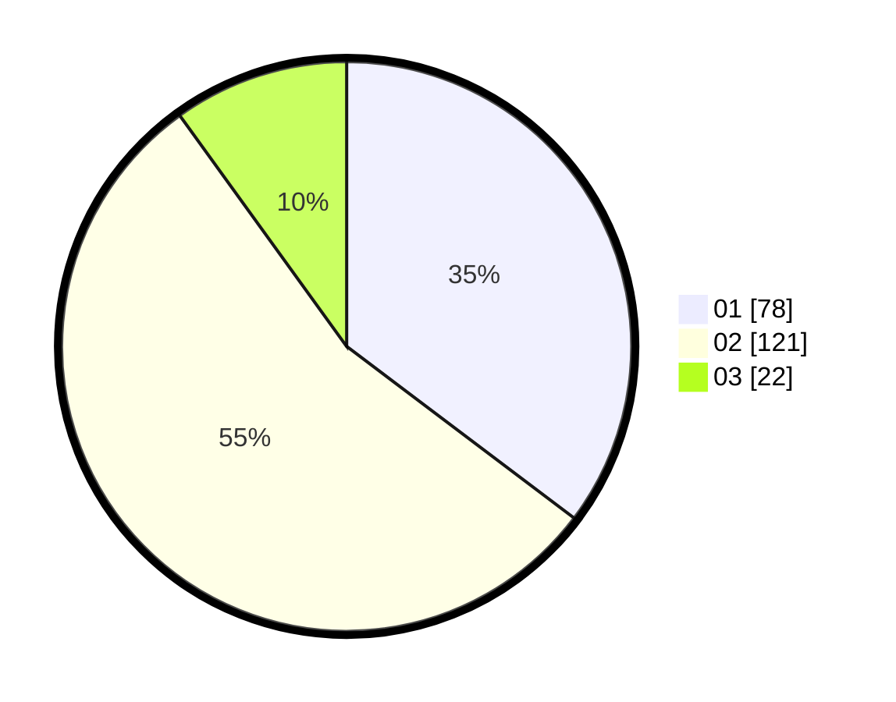

# Hasil

Hasil perolehan suara paslon dapat dilihat pada file paslon-01.txt, paslon-02.txt, dan paslon-03.txt.

Jika tidak ada, artinya data tersebut belum ada pada SIREKAP.

## Perolehan Suara

 * Paslon 01: **78**.
 * Paslon 02: **121**.
 * Paslon 03: **22**.

## Foto C Plano

https://sirekap-obj-formc.kpu.go.id/1527/pemilu/ppwp/31/75/04/10/02/3175041002095-20240215-004843--cb475985-0b11-4cfd-9bc0-b41336a52b64.jpg

https://sirekap-obj-formc.kpu.go.id/1527/pemilu/ppwp/31/75/04/10/02/3175041002095-20240215-004926--4d8c6bc9-760d-4c8c-8a1e-dcf0684dd23e.jpg

https://sirekap-obj-formc.kpu.go.id/1527/pemilu/ppwp/31/75/04/10/02/3175041002095-20240215-004614--b936df38-fe85-489e-9f7f-01264f5d7b45.jpg

## DATA PEMILIH TETAP

Jumlah pemilih dalam DPT: **226**.
 * L: **97**.
 * P: **129**.

## DATA PENGGUNA HAK PILIH

Jumlah pengguna hak pilih dalam DPT: **219**.
 * L: **94**.
 * P: **125**.

Jumlah pengguna hak pilih dalam DPTb: **2**.
 * L: **1**.
 * P: **1**.

Jumlah pengguna hak pilih dalam DPK: **5**.
 * L: **2**.
 * P: **3**.

Jumlah pengguna hak pilih: **226**.
 * L: **97**.
 * P: **129**.

## JUMLAH SUARA SAH DAN TIDAK SAH

JUMLAH SELURUH SUARA SAH: **221**.

JUMLAH SUARA TIDAK SAH: **5**.

JUMLAH SELURUH SUARA SAH DAN SUARA TIDAK SAH: **226**.
