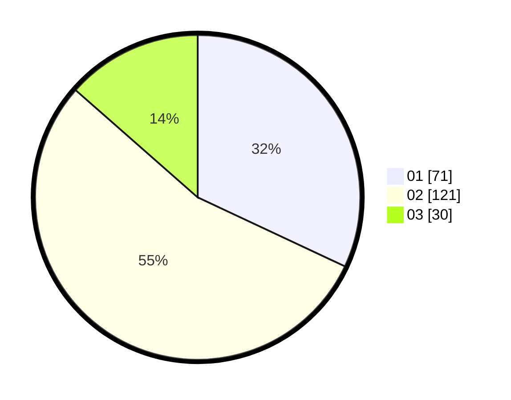

# Hasil

Hasil perolehan suara paslon dapat dilihat pada file paslon-01.txt, paslon-02.txt, dan paslon-03.txt.

Jika tidak ada, artinya data tersebut belum ada pada SIREKAP.

## Perolehan Suara

 * Paslon 01: **71**.
 * Paslon 02: **121**.
 * Paslon 03: **30**.

## Foto C Plano

https://sirekap-obj-formc.kpu.go.id/0fb3/pemilu/ppwp/31/75/04/10/02/3175041002104-20240218-210653--9877b7df-aa56-4b29-a750-7a1c2a3a0b25.jpg

https://sirekap-obj-formc.kpu.go.id/0fb3/pemilu/ppwp/31/75/04/10/02/3175041002104-20240218-211057--475f2825-0694-4a28-820b-4612892c2bcd.jpg

https://sirekap-obj-formc.kpu.go.id/0fb3/pemilu/ppwp/31/75/04/10/02/3175041002104-20240218-211629--915aeee3-b8da-4515-a1de-1bdb1adef4d0.jpg

## DATA PEMILIH TETAP

Jumlah pemilih dalam DPT: **272**.
 * L: **142**.
 * P: **130**.

## DATA PENGGUNA HAK PILIH

Jumlah pengguna hak pilih dalam DPT: **225**.
 * L: **113**.
 * P: **112**.

Jumlah pengguna hak pilih dalam DPTb: **0**.
 * L: **0**.
 * P: **0**.

Jumlah pengguna hak pilih dalam DPK: **0**.
 * L: **0**.
 * P: **0**.

Jumlah pengguna hak pilih: **225**.
 * L: **113**.
 * P: **112**.

## JUMLAH SUARA SAH DAN TIDAK SAH

JUMLAH SELURUH SUARA SAH: **222**.

JUMLAH SUARA TIDAK SAH: **3**.

JUMLAH SELURUH SUARA SAH DAN SUARA TIDAK SAH: **225**.
