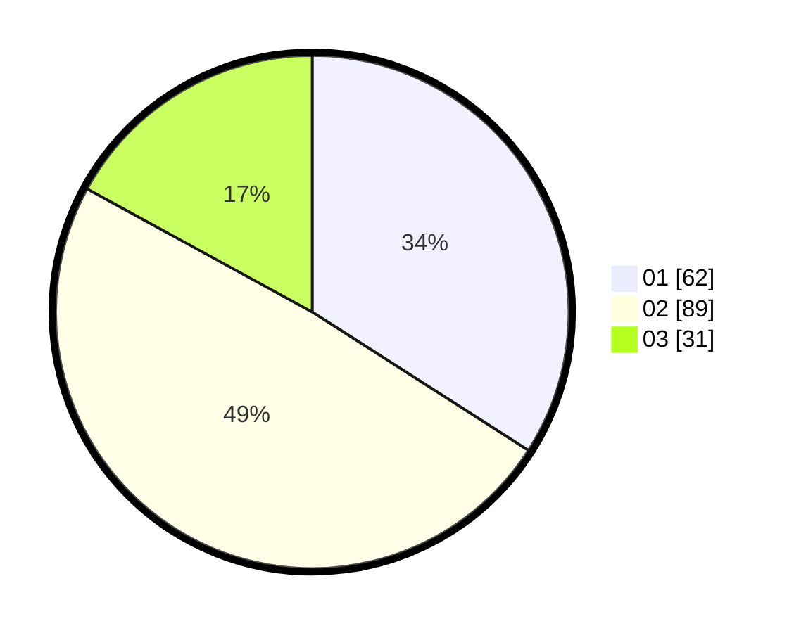

# Hasil

Hasil perolehan suara paslon dapat dilihat pada file paslon-01.txt, paslon-02.txt, dan paslon-03.txt.

Jika tidak ada, artinya data tersebut belum ada pada SIREKAP.

## Perolehan Suara

 * Paslon 01: **62**.
 * Paslon 02: **89**.
 * Paslon 03: **31**.

## Foto C Plano

https://sirekap-obj-formc.kpu.go.id/68ea/pemilu/ppwp/31/75/04/10/02/3175041002106-20240217-104249--2905b2b5-2b5b-4f6d-bb1e-53aef0a4f3dc.jpg

https://sirekap-obj-formc.kpu.go.id/68ea/pemilu/ppwp/31/75/04/10/02/3175041002106-20240217-104928--b49d8fac-c267-40e3-b41f-df7c0c1e6c35.jpg

https://sirekap-obj-formc.kpu.go.id/68ea/pemilu/ppwp/31/75/04/10/02/3175041002106-20240217-105349--25775b36-285c-4b6d-9d15-d04fe6456563.jpg

## DATA PEMILIH TETAP

Jumlah pemilih dalam DPT: **294**.
 * L: **145**.
 * P: **149**.

## DATA PENGGUNA HAK PILIH

Jumlah pengguna hak pilih dalam DPT: **169**.
 * L: **76**.
 * P: **93**.

Jumlah pengguna hak pilih dalam DPTb: **0**.
 * L: **0**.
 * P: **0**.

Jumlah pengguna hak pilih dalam DPK: **19**.
 * L: **11**.
 * P: **8**.

Jumlah pengguna hak pilih: **188**.
 * L: **87**.
 * P: **101**.

## JUMLAH SUARA SAH DAN TIDAK SAH

JUMLAH SELURUH SUARA SAH: **182**.

JUMLAH SUARA TIDAK SAH: **6**.

JUMLAH SELURUH SUARA SAH DAN SUARA TIDAK SAH: **188**.
